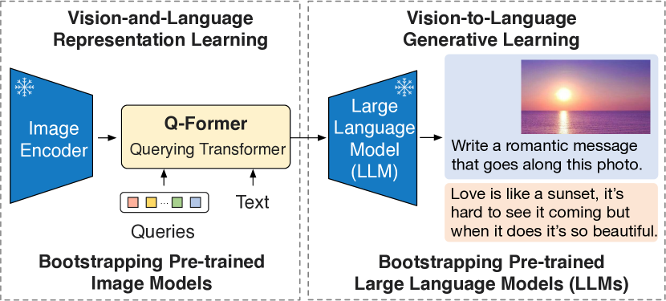
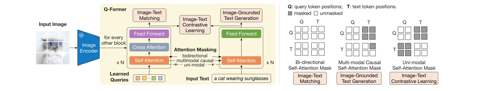

# VLM 主流架构详解

深入解析各主流 VLM 的具体架构设计、训练策略和核心创新。

## 一、LLaVA 系列（最经典、最简洁）

### 1.1 LLaVA (2023.04)

**核心思想**：用最简单的架构证明 VLM 不需要复杂的 Q-Former。

```
架构:
  图像 → CLIP ViT-L/14 (224px) → 256 个 patch 特征
       → 单层 Linear 投影 → 视觉 token
       + 文本 token → Vicuna-13B → 回答
```

**数据创新**：用 GPT-4 生成视觉指令数据
- 将图像的 caption 和 bbox 信息发给 GPT-4（纯文本）
- GPT-4 生成对话、详细描述、复杂推理等指令数据
- 共 158K 条，开创了 VLM 指令数据的构造范式

### 1.2 LLaVA-1.5 (2023.10)

在 LLaVA 基础上的关键改进：

| 改进点 | LLaVA | LLaVA-1.5 |
|--------|-------|-----------|
| 投影层 | 单层 Linear | 两层 MLP + GELU |
| 分辨率 | 224px | 336px |
| 训练数据 | 158K | 665K (加入学术 VQA 数据) |
| ViT | CLIP ViT-L/14 | CLIP ViT-L/14 @336px |

> **重要发现**：仅通过简单改进（MLP 投影 + 更高分辨率 + 更多数据），就超越了复杂架构（如 InstructBLIP），再次证明**数据 > 架构**。

### 1.3 LLaVA-NeXT / LLaVA-OneVision (2024)

```
关键改进:
1. 动态高分辨率 (AnyRes):
   - 不再固定 336px，支持多种分辨率
   - 将图像切成多个 tile + 一个全局缩略图
   - 大幅提升 OCR 和文档理解能力

2. 更强的 LLM:
   - 从 Vicuna → Qwen2, LLaMA-3

3. 统一图像/视频/多图:
   - LLaVA-OneVision 用一个模型处理所有视觉输入
```

### 1.4 LLaVA 系列训练流程

```
Stage 1: 预训练对齐 (约 1 epoch)
├── 数据: 558K 图文描述对 (LCS-558K, LAION-CC-SBU 子集)
├── 可训练: 仅投影层 MLP
├── 冻结: ViT + LLM
├── 目的: 学会将视觉特征映射到 LLM 的语义空间
└── 耗时: 约 5.5 小时 (8×A100)

Stage 2: 视觉指令微调 (约 1 epoch)
├── 数据: 665K 混合数据 (对话 + VQA + OCR + 推理...)
├── 可训练: 投影层 + LLM (全量微调)
├── 冻结: ViT
├── 目的: 学会遵循多种视觉指令
└── 耗时: 约 20 小时 (8×A100)
```

**为什么要分两个阶段？**

ViT 和 LLM 来自不同的预训练体系，特征空间完全不对齐。如果跳过 Stage 1 直接端到端训练，投影层还没学会对齐，LLM 收到的视觉 token 相当于噪声，会导致梯度混乱，甚至让 LLM 学会忽略视觉输入、仅靠文本先验回答（捷径学习）。

分两阶段的好处：
- **Stage 1 先"对齐"**：用简单的图文描述对，只训练投影层，让它学会把 ViT 特征翻译成 LLM 能理解的语义。此时冻结 LLM 是为了保护其已有的语言能力不被噪声破坏。
- **Stage 2 再"学任务"**：投影层已经能输出有意义的视觉 token，LLM 可以安全地解冻微调，学习复杂的视觉指令（对话、推理、OCR 等）。

简言之：**Stage 1 解决"看得懂"（特征对齐），Stage 2 解决"做得好"（任务能力）**。每个阶段优化目标单纯，训练更稳定。

---

## 二、BLIP-2 (2023.01)

### 2.1 核心创新：Q-Former

BLIP-2 的关键贡献是 Q-Former——一个轻量级 Transformer，用于桥接冻结的 ViT 和冻结的 LLM。



> 图源: *BLIP-2*, Figure 1.

**设计动机**：ViT 和 LLM 都非常大，全量微调成本高。Q-Former 只有约 188M 参数，可以低成本训练。

### 2.2 Q-Former 内部结构



> 图源: *BLIP-2*, Figure 2.

```
Q-Former 结构:
├── 32 个可学习 Query Token (每个 768 维)
├── Self-Attention 层 (query 之间交互)
├── Cross-Attention 层 (query → ViT 输出)
└── Feed-Forward 层

信息流:
  ViT 输出 (257×1408) ──Cross-Attention──→ Query (32×768)
                                              │
                                        Self-Attention
                                              │
                                        Feed-Forward
                                              ↓
                                       32 个压缩特征
```

### 2.3 BLIP-2 两阶段训练

**第一阶段：视觉-语言表示学习（训练 Q-Former）**

三个联合目标：

| 目标 | 全称 | 作用 |
|------|------|------|
| **ITC** | Image-Text Contrastive | 对齐 query 和文本的全局表示 |
| **ITM** | Image-Text Matching | 二分类判断图文是否匹配 |
| **ITG** | Image-grounded Text Generation | 用视觉信息生成文本 |

核心巧妙之处：**同一个 Q-Former，通过切换注意力掩码实现三个不同目标**。

**ITC（对比学习）**：让匹配的图文对在表示空间中靠近，不匹配的远离。

```
实现:
  图像侧: 32 个 query 经过 Q-Former → 每个 query 的输出和文本表示算相似度 → 取最大值
  文本侧: Q-Former 文本编码器 → [CLS] token 输出

  注意力掩码 (Uni-modal):
    ┌─────┬─────┐
    │  Q  │  T  │
  Q │  ✓  │  ✗  │  ← query 之间互相看，但看不到文本
  T │  ✗  │  ✓  │  ← 文本之间互相看，但看不到 query
    └─────┴─────┘

  为什么隔离？如果 query 能看到文本，直接从文本抄答案，不需要从图像提取信息 → 对比学习失效
```

**ITM（二分类匹配）**：给一对图文，判断是否匹配（比 ITC 更细粒度的交互）。

```
实现:
  让 query 和文本充分交互，输出过二分类头 → 匹配/不匹配

  注意力掩码 (Bi-directional):
    ┌─────┬─────┐
    │  Q  │  T  │
  Q │  ✓  │  ✓  │  ← query 可以看到所有文本
  T │  ✓  │  ✓  │  ← 文本也可以看到所有 query
    └─────┴─────┘

  难负样本挖掘: 用 ITC 的相似度找"相似但不匹配"的样本，让模型学得更好
```

**ITG（生成文本）**：给图像，让 Q-Former 自回归生成对应描述。

```
实现:
  query 从图像提取信息 → 文本部分用 causal mask 自回归生成

  注意力掩码 (Multimodal Causal):
    ┌─────┬──────────────┐
    │  Q  │  T1  T2  T3  │
  Q │  ✓  │  ✗   ✗   ✗   │  ← query 互相看，但不看文本（从图像提取信息）
  T1│  ✓  │  ✓   ✗   ✗   │  ← T1 看 query + 自己
  T2│  ✓  │  ✓   ✓   ✗   │  ← T2 看 query + T1 + 自己
  T3│  ✓  │  ✓   ✓   ✓   │  ← T3 看 query + 前面所有文本
    └─────┴──────────────┘
```

**三个目标的训练细节：一个 batch，三个目标，一次反向**

每个训练 batch 包含 N 对 (图像, 文本)。对于同一个 batch，Q-Former 按顺序完成三个目标的前向传播，每次切换不同的注意力掩码：

```
一个 batch 的训练流程:

Step 1: ITC 前向
├── 注意力掩码: Uni-modal（Q 和 T 互相隔离）
├── 图像侧: 32 个 query 各自得到一个输出向量，和文本 [CLS] 算余弦相似度，取 max → s(I,T)
├── 文本侧: [CLS] token 输出作为文本表示
├── 对 batch 内所有 N×N 对计算相似度矩阵
├── 用 InfoNCE loss（对角线为正样本，其余为负样本）
└── 🔑 副产物: 得到一个 N×N 的相似度矩阵 sim_matrix

Step 2: ITM 前向（利用 Step 1 的相似度矩阵）
├── 注意力掩码: Bi-directional（Q 和 T 完全互通）
├── 因为 query 和 text 需要互相看（双向注意力），每对 (图, 文) 必须拼在一起做一次完整前向
├── 样本构成（共 3N 对，每对各需一次前向）:
│   ├── N 个正样本: batch 中原本配对的 (img_i, text_i)
│   ├── N 个难负样本（图找难文本）← 🔑 用 ITC 的 sim_matrix:
│   │   对每张 img_i，在 sim_matrix 第 i 行中排除正确配对，取相似度最高的 text_j
│   │   → (img_i, text_j) 标记为"不匹配"
│   └── N 个难负样本（文本找难图像）:
│       对每段 text_i，在 sim_matrix 第 i 列中排除正确配对，取相似度最高的 img_k
│       → (img_k, text_i) 标记为"不匹配"
├── 为什么用"难"负样本？随机负样本太容易区分（猫的图配讲火箭的文本），模型学不到东西
│   相似度高但不匹配的样本才能逼模型学到细粒度区分
├── 32 个 query 输出各自过一个二分类头 → 平均 → 匹配/不匹配
└── 用 Binary Cross-Entropy loss（3N 个样本的 loss 平均为一个标量 L_ITM）

Step 3: ITG 前向
├── 注意力掩码: Multimodal Causal（query 互看，文本 causal）
├── 给图像，让文本部分自回归生成对应描述
├── 文本输入前面加 [DEC] token（区别于 ITC/ITM 用的 [CLS]）
└── 用标准 Language Modeling loss（cross-entropy）

最终: L_total = L_ITC + L_ITM + L_ITG  （三个 loss 直接相加）
```

**关键设计点**：

1. **同一个 Q-Former 权重**，三次前向只是注意力掩码不同。反向传播时三个 loss 的梯度累加，共同更新同一组参数
2. **ITC → ITM 的信息传递**不是梯度层面的，而是 ITC 的相似度分数被当作"难度指标"来**采样** ITM 的负样本。这比随机负样本有效得多——随机负样本太容易区分（比如猫的图配了一段讲汽车的文本），模型学不到东西
3. **三个目标互补**：ITC 学粗粒度全局对齐（哪张图配哪段文本）→ ITM 学细粒度判别（这对图文到底匹不匹配）→ ITG 学生成能力（从图像信息生成语言）。从对齐到判别到生成，能力递进

**第二阶段：生成式预训练（连接 LLM）**

```
冻结 ViT → Q-Former (微调) → Linear → 冻结 LLM
                                         ↓
          32 个视觉 token 作为 LLM 的 "soft prompt"
```

### 2.4 BLIP-2 的优劣

| 优势 | 劣势 |
|------|------|
| 训练成本低（只训 Q-Former） | 压缩信息丢失（32 个 token 看不清细节） |
| 可适配不同 LLM | Q-Former 训练复杂（3 个目标） |
| 推理高效（视觉 token 少） | 在 OCR/文档理解任务上较弱 |

---

## 三、InternVL 系列（开源最强之一）

### 3.1 InternVL 1.0 (2023.12)

核心创新：**自训练超大视觉编码器 InternViT-6B**。

```
为什么要自训 ViT？
- CLIP ViT 最大到 ~2B 参数，而 LLM 已经到 70B+
- ViT 和 LLM 的参数量差距太大，成为瓶颈
- InternViT-6B 是当时最大的开源 ViT

InternViT-6B 架构:
  - 参数量: 6B（48 层 Transformer，hidden_dim=3200，head=25）
  - 输入: 224×224 或 448×448 图像
  - 输出: 256 或 1024 个 patch token（取决于分辨率）
  - 对比: CLIP ViT-L = 300M, EVA-CLIP ViT-G = 1.8B

InternViT-6B 训练:
  渐进式训练（Progressive Training）
  ViT-L (~300M) → ViT-H (~600M) → ViT-6B
  使用大规模图文对比学习
```

**渐进式训练**：不从零训练 6B 大模型，而是从小模型逐步"长大"——先训好 ViT-L，用其权重初始化 ViT-H 的对应层（新增参数随机初始化），继续训练；再同样扩展到 ViT-6B。好处是小模型已学到的视觉表征（边缘、纹理、语义等）可以被大模型直接继承，训练更稳定、收敛更快、总算力更省。这是大模型训练中的常见策略，ViT-22B、ProGAN 的渐进式分辨率增长等都采用了类似思路。

**InternVL 1.0 的整体架构**：

```
InternVL 1.0 架构:
  图像 → InternViT-6B → 视觉特征
       → QLLaMA（轻量 LLaMA + Cross-Attention）→ 对齐
       → LLM → 回答

QLLaMA 的角色 (类似 BLIP-2 的 Q-Former):
  - 96 个可学习 query token
  - 用 Cross-Attention 从 InternViT 提取信息
  - 目的: 压缩视觉 token + 对齐到语言空间
  → 后来被证明不如简单 MLP，在 1.5 中被替换
```

**训练策略（三阶段）**：

```
Stage 1: InternViT-6B 预训练
├── 任务: 图文对比学习（类 CLIP）
├── 数据: 大规模图文对（数十亿规模）
└── 目的: 训练一个强大的视觉编码器

Stage 2: QLLaMA 对齐训练
├── 冻结 InternViT-6B
├── 训练 QLLaMA 的 cross-attention 层
└── 目的: 将视觉特征对齐到语言空间

Stage 3: 端到端指令微调
├── 解冻所有组件
├── 使用视觉指令数据
└── 目的: 学习遵循指令
```

### 3.2 InternVL 1.5 (2024.04)

InternVL 1.5 是从 1.0 到 2.0 的关键跳跃，引入了两个核心改进：

#### 3.2.1 动态分辨率（Dynamic Resolution）

```
问题: 固定分辨率（如 448×448）导致:
  - 大图被缩小 → 细节丢失（尤其 OCR/文档）
  - 小图被放大 → 浪费计算
  - 长宽比变形 → 物体失真

解决方案: 动态切 tile
  1. 根据图像原始分辨率，选择最佳的 tile 排列方式
  2. 将图像切成若干 448×448 的 tile
  3. 同时保留一个 448×448 的全局缩略图
  4. 每个 tile 独立通过 InternViT-6B 编码

示例:
  输入: 1344×896 的图像
  → 选择 3×2 = 6 个 tile 的排列
  → 6 个 tile + 1 个全局缩略图 = 7 个输入
  → 每个产生 1024 个 patch token

  支持的 tile 排列（最多 12 个 tile）:
  1×1, 1×2, 2×1, 1×3, 3×1, 2×2, 1×4, 4×1,
  2×3, 3×2, 1×5, 5×1, ... 最高到 4×3 或 3×4

全局缩略图的作用:
  tile 只能看到局部 → 缺乏全局上下文
  全局缩略图（将整图缩放到 448×448）提供全局语义
  → 模型同时拥有局部细节 + 全局理解
```

#### 3.2.2 Pixel Shuffle 下采样

```
问题: 动态切 tile 导致 token 数爆炸
  7 个 tile × 1024 token = 7168 token → 太多了

Pixel Shuffle 原理（与超分辨率中的 Pixel Shuffle 相反）:
  原始 Pixel Shuffle（子像素卷积）: 通道 → 空间（用于超分辨率上采样）
  这里用的是 Pixel Unshuffle（反向操作）: 空间 → 通道（用于下采样）

  具体做法:
  ViT 输出: [1024, D]  → 重排为 [32×32, D] 的 2D 特征图
  Pixel Unshuffle (scale=2):
    将每 2×2 的相邻 patch 合并为 1 个 patch
    空间维度: 32×32 → 16×16
    通道维度: D → 4D（4 个 patch 的特征拼接到通道维度）
  结果: [16×16, 4D] = [256, 4D]

  最终: 1024 token → 256 token（4 倍压缩）

  然后通过 MLP 将 4D 投影回 LLM 的 hidden_dim

为什么用 Pixel Shuffle 而不是简单池化？
  平均池化: 丢失空间细节（把相邻特征取平均，信息被模糊）
  Pixel Unshuffle: 不丢失任何信息（只是重排），4 个 patch 的特征完整保留在通道维度
  → 信息无损压缩，只是换了表示形式
```

**Pixel Shuffle 直觉理解**

Pixel Shuffle 最初来自超分辨率领域（[Shi et al., 2016](https://arxiv.org/abs/1609.05158)），核心思想是**空间维度和通道维度之间的确定性重排**。

**正向 Pixel Shuffle**（超分辨率上采样，scale=2）：把低分辨率特征图"展开"成高分辨率。

```
输入: [H, W, C×r²]  →  输出: [H×r, W×r, C]   (r=2 时)

一个像素上的 4C 个通道被严格分成 4 组 (2×2)，
每组 C 个通道对应输出中 2×2 子像素网格的一个固定位置:

通道排列:                      展开到空间:
[C₁₁, C₁₂, C₂₁, C₂₂]         ┌─────┬─────┐
  ↓     ↓     ↓     ↓         │(1,1)│(1,2)│
                                ├─────┼─────┤
                                │(2,1)│(2,2)│
                                └─────┴─────┘
```

通道的排列顺序**本身就编码了空间位置**——第几组通道放到输出的第几个子像素位置，是固定的映射规则，不需要学习。**Pixel Shuffle 本身是纯 reshape 操作，零参数**；需要学习的是前面的卷积层，让它输出的通道值恰好是目标空间位置应有的值。

**反向 Pixel Unshuffle**（InternVL 用的）：把空间信息"折叠"进通道维度。

```
原始 32×32 特征图中的一个 2×2 区域:

┌────┬────┐                     ┌──────────────┐
│ A  │ B  │  Pixel Unshuffle →  │ [A; B; C; D] │  4 个特征拼接 → 4D 维
├────┼────┤                     └──────────────┘
│ C  │ D  │
└────┴────┘

对比:
  平均池化:       (A+B+C+D)/4 → D 维，四个特征被混合，信息丢失
  Pixel Unshuffle: [A;B;C;D]  → 4D 维，四个特征完整保留，只是换了排列方式
```

一句话总结：**Pixel Unshuffle 把相邻 2×2 个 token "叠"成 1 个更宽的 token（通道变 4 倍），空间缩小但信息零损失**。之后用 MLP 将 4D 维投影回 LLM 需要的维度。

#### 3.2.3 架构简化

```
InternVL 1.0 → 1.5 的架构变化:

1.0: InternViT-6B → QLLaMA (96 query, cross-attention) → LLM
1.5: InternViT-6B → Pixel Shuffle → MLP → LLM

关键变化:
  - 去掉了 QLLaMA，用简单的 MLP 替代
  - 和 LLaVA 的结论一致: 简单 MLP > 复杂 Q-Former/QLLaMA
  - Pixel Shuffle 负责 token 压缩（QLLaMA 之前的压缩功能）
  - MLP 只负责维度映射（对齐到 LLM 的 hidden_dim）
```

### 3.3 InternVL 2.0 (2024.07)

InternVL2 在 1.5 基础上的核心改进：

#### 3.3.1 全尺寸模型家族

```
InternVL2 模型矩阵:

| 模型名 | ViT | LLM | 总参数 |
|--------|-----|-----|--------|
| InternVL2-1B | InternViT-300M | InternLM2-1.8B | ~2B |
| InternVL2-2B | InternViT-300M | InternLM2-1.8B | ~2B |
| InternVL2-4B | InternViT-300M | Phi-3-mini-3.8B | ~4B |
| InternVL2-8B | InternViT-300M | InternLM2-7B | ~8B |
| InternVL2-26B | InternViT-6B | InternLM2-20B | ~26B |
| InternVL2-40B | InternViT-6B | Nous-Hermes-2-Yi-34B | ~40B |
| InternVL2-76B | InternViT-6B | Hermes-2-Llama-3.1-70B | ~76B |

关键设计选择:
  - 小模型（≤8B）: 用精简的 InternViT-300M，适合端侧部署
  - 大模型（≥26B）: 用完整的 InternViT-6B，追求最佳性能
  - LLM 不局限于 InternLM: 76B 版用 Llama-3.1-70B，40B 版用 Yi-34B
    → 选择当时最强的开源 LLM 作为骨干
```

#### 3.3.2 InternVL2 完整架构

```
高分辨率图像 (如 1344×896)
    │
    ├── 全局缩略图 (448×448) ──→ InternViT-6B → 1024 token
    │                                                │
    └── 切成 6 个 tile (每个 448×448)                │
        ├── tile 1 → InternViT-6B → 1024 token     │
        ├── tile 2 → InternViT-6B → 1024 token     │
        └── ...                                      │
                                                     ↓
                          所有 token 拼接 → Pixel Shuffle (4x 下采样)
                                                     │
                                              MLP 投影到 LLM 维度
                                                     │
                                              + 文本 token
                                                     ↓
                                           LLM → 回答

Token 数计算:
  每个 tile: 1024 → Pixel Shuffle → 256
  6 个 tile + 1 个全局 = 7 × 256 = 1792 个视觉 token
```

#### 3.3.3 训练策略

```
InternVL2 训练流程:

Stage 1: 视觉-语言对齐
├── 训练: MLP 投影层
├── 冻结: InternViT-6B + LLM
├── 数据: 大规模图文对
└── 目的: 对齐视觉和语言空间

Stage 2: 全参数端到端训练
├── 训练: InternViT-6B + MLP + LLM（全部解冻）
├── 数据: 多任务混合数据
│   ├── 图文描述、VQA、OCR/文档理解
│   ├── 视觉定位（bbox 输入输出）
│   ├── 多图理解
│   └── 视频理解（视频帧当作多图处理）
└── 目的: 全面提升多模态能力

关键点: 全参数训练
  与 LLaVA 冻结 ViT 不同，InternVL2 解冻了 InternViT-6B
  为什么可以？
  - InternViT-6B 本身就是为多模态设计和训练的
  - 不像 CLIP ViT 是为对比学习优化的，解冻后可能偏移
  - 6B 的 ViT 足够大，不容易被小规模微调破坏
  → 端到端训练让 ViT 的特征更适配下游 LLM
```

#### 3.3.4 多图与视频支持

```
多图输入:
  图 1 → InternViT → token_1 + <img_sep>
  图 2 → InternViT → token_2 + <img_sep>
  ...
  所有图的 token 拼接 + 文本 → LLM

视频输入:
  视频 → 均匀采样 N 帧（默认 16 帧）
  每帧当作一张"图"走相同流程
  但不使用 tile 切分（否则 token 数太多）
  → 每帧 256 token × 16 帧 = 4096 视觉 token
```

### 3.4 InternVL 2.5 (2024.12)

```
InternVL 2.5 的主要改进（在 2.0 架构基础上）:

1. 训练数据大幅扩充:
   - 更多高质量图文数据
   - 更多 OCR/文档/图表数据
   - 引入 Chain-of-Thought 推理数据
   → 数据质量和多样性是最大提升来源

2. 训练策略优化:
   - 更长的训练 schedule
   - 更精细的学习率调度
   - 多阶段渐进式数据混合

3. 推理能力提升:
   - 数学推理、代码生成、逻辑推理显著提升
   - 得益于引入 CoT 格式数据

4. 评测成绩:
   - 在多个基准上超越 GPT-4o
   - 特别在 OCR/文档理解上优势明显
```

### 3.5 InternVL 系列总结

| 版本 | 架构连接方式 | ViT 是否解冻 | 核心改进 |
|------|------------|-------------|---------|
| **1.0** | QLLaMA (cross-attention) | 冻结 | 6B ViT，渐进式训练 |
| **1.5** | Pixel Shuffle + MLP | 解冻 | 动态分辨率，去掉 QLLaMA |
| **2.0** | Pixel Shuffle + MLP | 解冻 | 全尺寸家族（1B~76B），多图/视频 |
| **2.5** | Pixel Shuffle + MLP | 解冻 | 更强数据，CoT 推理能力 |

**InternVL 系列的核心 Takeaway**：

1. **大 ViT 确实有用**：6B ViT 在细粒度理解（OCR、小物体）上明显优于 300M~2B 的 ViT
2. **架构从复杂到简单**：QLLaMA → Pixel Shuffle + MLP，简单投影赢了
3. **端到端训练是关键**：解冻 ViT 让视觉特征更适配 LLM，性能显著提升
4. **数据是持续提升的关键**：2.0 → 2.5 架构没变，主要靠数据和训练策略提升

---

## 四、Qwen-VL 系列

### 4.1 Qwen-VL (2023.08)

```
架构:
  图像 → ViT-bigG (自训) → 256 个视觉 token
       → 单层 Cross-Attention (Resampler) → 压缩
       + 文本 token → Qwen-7B → 回答

特点:
  - 支持多语言（中英日韩等）
  - 支持多图输入
  - 支持 bbox 输入输出（视觉定位）
```

### 4.2 Qwen2-VL (2024)

关键改进：**Naive Dynamic Resolution**

```
与 InternVL 的动态切片不同，Qwen2-VL 直接处理原始分辨率:
  - 不切 tile，直接将原始分辨率图像送入 ViT
  - ViT 输出的 token 数随分辨率动态变化
  - 用 2D-RoPE 处理不同分辨率的位置编码

优势: 避免 tile 切割导致的物体截断问题
劣势: 超高分辨率时 token 数可能很多
```

#### 2D-RoPE：让 ViT 支持任意分辨率的关键

**为什么标准 1D 位置编码不行？**

标准 ViT 将图像 patch 展平为一维序列后分配位置 ID：[0, 1, 2, ...]。这会**丢失二维空间结构**——展平后，水平相邻的 patch 距离为 1，而垂直相邻的 patch 距离等于一行的宽度（比如 32），模型无法区分"向右"和"向下"。

```
4×4 网格展平后:
┌───┬───┬───┬───┐
│ 0 │ 1 │ 2 │ 3 │     1D RoPE 认为:
├───┼───┼───┼───┤       patch 0→1 (右邻):  距离=1
│ 4 │ 5 │ 6 │ 7 │       patch 0→4 (下邻):  距离=4
├───┼───┼───┼───┤
│ 8 │ 9 │10 │11 │     但空间上两者都是紧挨着的邻居！
├───┼───┼───┼───┤     1D RoPE 把二维距离压成标量，
│12 │13 │14 │15 │     丢失了方向信息。
└───┴───┴───┘───┘
```

**2D-RoPE 的做法：把特征维度劈成两半，分别编码行和列**

每个 patch 不再只有一个标量位置 $m$，而是一个二维坐标 $(h, w)$：

```
位置标识的变化:
  1D RoPE:  patch 5 → m = 5
  2D RoPE:  patch 5 → (h=1, w=1)   ← 第 1 行第 1 列
```

对 query/key 向量的 $d$ 个维度，**前 $d/2$ 维用行索引 $h$ 做标准 RoPE 旋转，后 $d/2$ 维用列索引 $w$ 做标准 RoPE 旋转**：

$$R_{2D}(h, w) = \text{diag}\Big(\underbrace{R_{1D}(h)}_{\text{前 } d/2 \text{ 维}},\ \underbrace{R_{1D}(w)}_{\text{后 } d/2 \text{ 维}}\Big)$$

内积自然分解为两个独立的相对距离函数之和：

$$q'^T k' = \underbrace{q_{[0:d/2]}^T \cdot R(\Delta h) \cdot k_{[0:d/2]}}_{只依赖行距离\ \Delta h} + \underbrace{q_{[d/2:d]}^T \cdot R(\Delta w) \cdot k_{[d/2:d]}}_{只依赖列距离\ \Delta w}$$

```
验证: 从 patch (1,1) 出发
  右邻居 (1,2):  Δh=0, Δw=1 → score = f(0) + g(1)
  下邻居 (2,1):  Δh=1, Δw=0 → score = f(1) + g(0)
  → f(0)=g(0), f(1)=g(1) → 两个邻居 score 相等 ✓

对比 1D RoPE:
  右邻居 |5-6|=1 → f(1),  下邻居 |5-9|=4 → f(4)  ← 完全不同 ✗
```

**为什么支持任意分辨率？** RoPE 不存储任何位置向量表，只需要 $(h, w)$ 坐标就能动态计算旋转角。无论图像是 448×448 还是 1344×896，patch 坐标范围变了，计算方式不变——零外推问题。

### 4.3 Qwen2-VL 的 MoE 变体

Qwen2-VL-72B 实际使用了 MoE（Mixture of Experts）架构：
- 总参数 72B，但每次推理只激活约 12B
- 推理成本远低于同等参数的 Dense 模型

---

## 五、其他重要架构

### 5.1 Flamingo (2022.04, DeepMind)

VLM 的先驱之一：

```
关键创新:
1. Perceiver Resampler: 注意力池化压缩视觉 token
2. Gated Cross-Attention: 在 LLM 层间插入交叉注意力层
   - 不同于其他方案把视觉 token 和文本拼接
   - 而是在 LLM 的部分层间隔插入视觉-文本交叉注意力
   - 用可学习的门控参数控制视觉信息的注入强度

3. Few-shot 能力: 支持多图 few-shot（给几个示例图+答案，再问新图）
```

### 5.2 Cambrian-1 (2024, NYU)

**探索最优视觉表征**的系统性研究：

```
核心问题: 哪种 Vision Encoder 对 VLM 最好？

实验方法:
  测试了 20+ 种不同的 Vision Encoder
  包括: CLIP 系列、SigLIP、DINOv2、MAE、SAM encoder 等

关键发现:
1. 没有单一 encoder 在所有任务上最优
2. CLIP/SigLIP 在语义任务上领先
3. DINOv2 在空间/定位任务上领先
4. 多 encoder 融合 > 单一 encoder

最终方案: Spatial Vision Aggregator (SVA)
  融合多个 encoder 的特征，动态选择不同层的特征
```

### 5.3 DeepSeek-VL2 (2024)

```
创新点:
1. 使用 DeepSeek-MoE 作为 LLM 骨干
   - 总参数 16B，激活参数仅 2.8B
   - 推理速度快，成本低

2. 动态切片 + 高分辨率
   - 最高支持 1536×1536

3. 多粒度视觉特征
   - 同时保留全局和局部特征
```

---

## 六、架构对比总结

| 模型 | ViT | 投影方式 | LLM | 视觉 token 数 | 最高分辨率 |
|------|-----|---------|-----|-------------|-----------|
| LLaVA-1.5 | CLIP ViT-L | MLP | Vicuna-13B | 576 | 336px |
| BLIP-2 | EVA-CLIP ViT-G | Q-Former | FlanT5/Vicuna | 32 | 224px |
| InternVL2-76B | InternViT-6B | Pixel Shuffle + MLP | InternLM2-76B | 动态 | 动态 tile |
| Qwen2-VL-72B | ViT-bigG (自训) | MLP | Qwen2-72B (MoE) | 动态 | 原始分辨率 |
| LLaVA-OneVision | SigLIP | MLP | Qwen2-72B | 动态 | 动态 tile |
| DeepSeek-VL2 | SigLIP | MLP | DeepSeek-MoE | 动态 | 1536px |

### 架构演进趋势

```
2022: 冻结一切，只训连接器 (Flamingo, BLIP-2)
         ↓ 训练更多参数效果更好
2023: 冻结 ViT，训连接器 + LLM (LLaVA)
         ↓ 更大的 ViT 更好
2024: 全部解冻，端到端训练 (InternVL2, Qwen2-VL)
         ↓ 下一步？
2025: 原生多模态预训练？(不再分三个组件)
```

---

**相关文档**：
- [VLM 概述](VLM概述.md) — VLM 总览与入门
- [VLM 三大组件详解](VLM三大组件详解.md) — 各组件的深入分析
- [VLM 关键技术](VLM关键技术.md) — 高分辨率处理、Token 压缩等
- [VLM 训练与评测](VLM训练与评测.md) — 训练流程与评测基准
- [视频 VLM 详解](视频VLM详解.md) — 视频理解架构与长视频处理

[返回上级](README.md) | [返回总目录](../../README.md)
