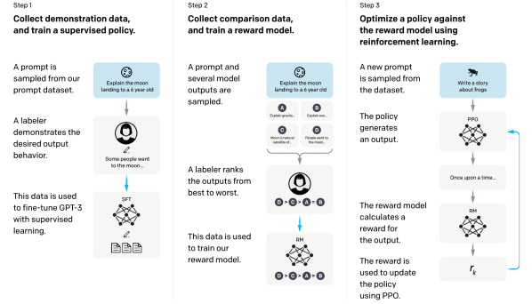

# RLHF 与 PPO 详解

RLHF (Reinforcement Learning from Human Feedback) 是 OpenAI 在 InstructGPT (2022) 中提出并推广的对齐方法，通过强化学习让模型输出符合人类偏好。

## 一、为什么需要 RLHF？

SFT 只能模仿固定答案，但无法学习**什么是更好的回答**。人类偏好是一个相对概念——不是"对错"，而是"更好还是更差"。

| 场景 | SFT 能做到 | RLHF 能做到 |
|------|-----------|-------------|
| 回答正确性 | 能模仿正确答案 | 能学会判断正确性 |
| 回答风格 | 模仿固定风格 | 学会人类偏好的风格 |
| 安全对齐 | 靠过滤训练数据 | 主动学会拒绝有害请求 |
| 超越标注者 | 不能，上限是标注数据 | 理论上可以（通过探索） |

## 二、RLHF 三步流程

```
Step 1: SFT           →  得到初始策略模型 π_SFT
Step 2: 训练奖励模型   →  得到 Reward Model (RM)
Step 3: PPO 强化学习   →  得到最终对齐模型 π_RL
```

### Step 1: SFT（已在 SFT 文档中详述）

### Step 2: 训练奖励模型 (Reward Model)

#### 数据收集

1. 给定一个 prompt，让 SFT 模型生成 **多个** 不同的回答（通常 4~9 个）
2. 人类标注者对这些回答进行 **排序**（不是打分）
3. 将排序转化为 **偏好对 (chosen, rejected)**

```
Prompt: "解释量子计算"
回答 A: [详细准确的解释]     ← chosen (更好)
回答 B: [不太准确的解释]     ← rejected (更差)
```

#### 模型结构

- 通常基于 SFT 模型初始化，去掉最后的 language modeling head
- 换成一个 **标量输出头**，对整个回答输出一个标量分数

#### 训练目标

Bradley-Terry 模型，最大化好回答与差回答的分数差：

$$L_{RM} = -\log \sigma(r_\theta(x, y_w) - r_\theta(x, y_l))$$

其中：
- $r_\theta(x, y)$：奖励模型对 prompt $x$ 和回答 $y$ 的打分
- $y_w$：人类偏好的回答 (chosen/winner)
- $y_l$：不被偏好的回答 (rejected/loser)
- $\sigma$：sigmoid 函数

### Step 3: PPO 优化

#### PPO 是什么

Proximal Policy Optimization，近端策略优化，是 OpenAI 提出的强化学习算法。核心思想是在更新策略时限制更新幅度，防止策略崩溃。

#### RLHF 中的 RL 框架映射

| RL 概念 | 在 RLHF 中的对应 |
|---------|------------------|
| **环境 (Environment)** | 用户的 prompt |
| **状态 (State)** | 当前已生成的 token 序列 |
| **动作 (Action)** | 生成下一个 token |
| **策略 (Policy)** | 语言模型 $\pi_\theta$ |
| **奖励 (Reward)** | 奖励模型对完整回答的打分 |

#### InstructGPT 三阶段训练流程



> 图源: *Training language models to follow instructions with human feedback (InstructGPT)*, Figure 2. Step 1: SFT 有监督微调; Step 2: 训练奖励模型; Step 3: PPO 强化学习优化。

#### 训练中涉及的四个模型

| 模型 | 说明 |
|------|------|
| **Actor (策略)** | 正在训练的模型，参数 θ |
| **Critic (价值)** | 估计状态价值 V(s)，参数 φ |
| **Reference Model** | 冻结的 SFT 模型，用于计算 KL 惩罚 |
| **Reward Model** | 冻结的奖励模型，提供奖励信号 |

> 同时加载 4 个模型，这就是 PPO 显存开销巨大的原因。

#### 优化目标

$$\max_\theta \; \mathbb{E}_{x \sim D, \, y \sim \pi_\theta(\cdot|x)} \left[ r_\phi(x, y) - \beta \cdot \text{KL}(\pi_\theta \| \pi_{ref}) \right]$$

- **第一项** $r_\phi(x, y)$：最大化奖励模型的打分
- **第二项** $\text{KL}(\pi_\theta \| \pi_{ref})$：KL 散度惩罚，防止模型偏离原始 SFT 模型太远
- **$\beta$**：KL 惩罚系数，控制探索与保守之间的平衡

#### 为什么需要 KL 惩罚？

没有 KL 约束时，模型会 **reward hacking**——找到奖励模型的漏洞，生成得分高但实际质量差的回答。例如：
- 无限重复某些让 RM 给高分的短语
- 生成过长的回答（RM 可能偏好长文本）
- 产生不自然但高分的文本

#### PPO 的 Clipped Objective

$$L^{CLIP} = \mathbb{E}\left[\min\left(\frac{\pi_\theta(a|s)}{\pi_{\theta_{old}}(a|s)} A_t, \; \text{clip}\left(\frac{\pi_\theta(a|s)}{\pi_{\theta_{old}}(a|s)}, 1-\epsilon, 1+\epsilon\right) A_t\right)\right]$$

- 概率比 $\frac{\pi_\theta}{\pi_{\theta_{old}}}$ 被裁剪在 $[1-\epsilon, 1+\epsilon]$ 范围内
- $\epsilon$ 通常取 0.2
- $A_t$ 是优势函数 (advantage)，衡量某个动作比平均好多少

## 三、RLHF + PPO 的优缺点

### 优点

- 理论上能超越标注者水平（通过探索）
- 经过充分验证，InstructGPT / ChatGPT / GPT-4 均使用
- 能有效进行安全对齐

### 缺点

| 问题 | 说明 |
|------|------|
| **训练不稳定** | PPO 对超参数敏感，容易崩溃 |
| **显存巨大** | 同时需要 4 个模型（Actor + Critic + RM + Ref） |
| **工程复杂** | 需要精心设计采样、归一化、裁剪等细节 |
| **奖励模型质量** | RM 的错误会被 PPO 放大（garbage in, garbage out） |
| **Reward Hacking** | 即使有 KL 惩罚，仍可能出现 |

> 这些痛点催生了 DPO、GRPO 等替代方案。

## 四、工程实践要点

- **奖励归一化**：对 RM 输出做 whitening（均值为 0，方差为 1）
- **GAE (Generalized Advantage Estimation)**：使用 $\lambda$-return 估计优势函数，平衡偏差与方差
- **Mini-batch 更新**：每次采样后做多次梯度更新（通常 2~4 次）
- **梯度裁剪**：防止梯度爆炸
- **框架**：TRL (Hugging Face)、OpenRLHF、DeepSpeed-Chat

---

**相关文档**：
- [预训练与后训练](预训练与后训练.md)
- [SFT详解](SFT详解.md)
- [DPO详解](DPO详解.md)
- [GRPO详解](GRPO详解.md)

[返回上级](README.md) | [返回总目录](../../README.md)
