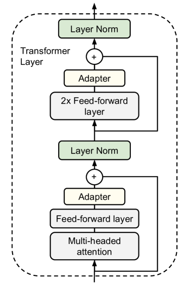

# SFT 详解 (Supervised Fine-Tuning)

有监督微调，是后训练的第一步，将基座模型转变为能遵循指令的助手模型。

## 一、核心思想

用 **(指令, 高质量回答)** 配对数据，以监督学习的方式微调基座模型。

本质上仍然是 **next token prediction**，但只在回答部分计算损失（指令部分的 token 被 mask 掉，不参与梯度更新）。

```
[指令 token ... ] [回答 token ...]
      ↑ 不计算 loss       ↑ 计算 loss
```

## 二、数据格式

### 单轮对话

```json
{
  "instruction": "解释什么是梯度下降",
  "output": "梯度下降是一种优化算法..."
}
```

### 多轮对话

```json
{
  "messages": [
    {"role": "system", "content": "你是一个有帮助的助手。"},
    {"role": "user", "content": "什么是梯度下降？"},
    {"role": "assistant", "content": "梯度下降是..."},
    {"role": "user", "content": "它有哪些变体？"},
    {"role": "assistant", "content": "主要变体包括..."}
  ]
}
```

> 通常只对 `assistant` 角色的 token 计算 loss。

### Chat Template

每个模型有自己的对话模板，将 messages 格式转化为实际输入的 token 序列。例如 ChatML 格式：

```
<|im_start|>system
你是一个有帮助的助手。<|im_end|>
<|im_start|>user
什么是梯度下降？<|im_end|>
<|im_start|>assistant
梯度下降是...<|im_end|>
```

不同模型模板不同（LLaMA 用 `[INST]`，Qwen 用 ChatML），**用错模板会严重影响效果**。HuggingFace 的 `tokenizer.apply_chat_template()` 可自动处理。

## 三、关键技术细节

### 损失函数

标准交叉熵，但只在回答部分计算（对 response token 数取平均）：

$$L_{SFT} = -\frac{1}{|T_{\text{resp}}|}\sum_{t \in \text{response}} \log P_\theta(x_t | x_{\lt t})$$

其中 $|T_{\text{resp}}|$ 是回答部分的 token 数。不取平均的话，长回答的 loss 天然比短回答大，会导致梯度尺度不一致。

### 学习率

- 比预训练低 1~2 个数量级，通常 1e-5 ~ 5e-5
- 使用 cosine 或 linear decay 调度
- 预热步数较少（几十到几百步）

### 训练轮次

- 通常 1~3 个 epoch
- 过多 epoch 容易过拟合（SFT 数据量远小于预训练数据）
- 观察验证集 loss，一旦开始上升就停止

### Packing（序列打包）

- 将多条短样本拼接到一个序列中，填满 max_length
- 用 attention mask 隔离不同样本，防止跨样本注意力
- 提升 GPU 利用率，避免 padding 浪费
- 注意：需要正确处理 position_ids 和 loss mask

### NEFTune（噪声嵌入微调）

- 在 embedding 层输出上添加均匀分布噪声
- 论文发现可以提升 SFT 效果（类似正则化）
- 实现简单：`embedding_output += noise * alpha / sqrt(seq_len * hidden_dim)`

## 四、SFT 数据质量 > 数量

### 关键发现

- **LIMA 论文 (2023)**：仅用 1000 条高质量数据做 SFT，效果接近 GPT-4 时代的模型
- 核心洞察：SFT 不是"教"模型新知识，而是"激活"预训练中已学到的能力，教它以正确的格式输出
- **Superficial Alignment Hypothesis**：对齐是表面的，模型的知识和能力几乎全部来自预训练

### 数据质量原则

1. **多样性**：覆盖不同任务类型（问答、写作、代码、数学、翻译等）
2. **准确性**：回答必须正确，错误回答会直接污染模型
3. **风格一致性**：保持统一的回答风格和格式
4. **适当长度**：过短缺乏信息，过长引入噪声
5. **去重**：相似的指令太多会导致过拟合某类任务

### 常见数据来源

| 来源 | 说明 | 代表 |
|------|------|------|
| 人工标注 | 质量最高，成本也最高 | InstructGPT 的标注数据 |
| 蒸馏 (Distillation) | 用更强的模型（如 GPT-4）生成回答 | Alpaca、Vicuna |
| Self-Instruct | 让模型自己生成指令和回答，人工筛选 | Self-Instruct 论文 |
| 真实对话 | 从用户实际使用中收集（脱敏） | ShareGPT |
| 开源数据集 | 社区整理的高质量数据 | OpenHermes、Infinity-Instruct |

## 五、多阶段 SFT

实际生产中，SFT 通常不是一步完成，而是分阶段进行：

```
阶段 1: 通用 SFT
├── 大量通用指令数据（10万~100万条）
├── 学会基本的指令遵循和对话格式
└── 学习率较高，训练较多步

阶段 2: 能力增强 SFT
├── 针对性数据（数学、代码、长文本等）
├── 提升特定能力
└── 数据量中等

阶段 3: 安全 & 风格 SFT
├── 少量高质量安全数据 + 风格数据
├── 微调回答风格、拒绝策略
└── 学习率很低，少量步数
```

> 类似预训练中的数据课程 (Curriculum)，先粗后细。

## 六、灾难性遗忘 (Catastrophic Forgetting)

SFT 的一个重要问题：在新数据上微调后，模型**忘记**了预训练/之前学到的能力。

### 表现

- 微调了中文对话后，英文能力下降
- 微调了代码后，通用问答变差
- 微调了安全拒绝后，有用性降低

### 缓解方法

| 方法 | 原理 |
|------|------|
| **数据混合 (Replay)** | 在 SFT 数据中混入一定比例的预训练数据 |
| **低学习率** | 减小参数更新幅度 |
| **LoRA** | 只更新少量参数，基座模型冻结，天然缓解遗忘 |
| **EWC / L2 正则化** | 约束重要参数不要变化太大（见下方详解） |
| **多任务混合训练** | 保证 SFT 数据覆盖所有需要保留的能力 |

### L2 正则化防遗忘

注意这里的 L2 正则化 **不是** 普通的 weight decay（把参数往 0 拉），而是把参数 **往预训练权重拉**：

$$\mathcal{L} = \mathcal{L}_{SFT} + \frac{\lambda}{2} \sum_i (w_i - w_i^{pretrained})^2$$

直觉：惩罚的不是参数的大小，而是参数 **偏离预训练值的程度**。微调时如果某个参数想跑太远，这个惩罚项就会把它拉回来，从而保留预训练学到的能力。

对 $w_i$ 求梯度，惩罚项贡献 $\lambda(w_i - w_i^{pretrained})$，更新规则变成：

$$w_i \leftarrow w_i - \eta\left(\nabla \mathcal{L}_{SFT} + \lambda(w_i - w_i^{pretrained})\right)$$

当 $w_i$ 远离预训练值时，惩罚梯度增大，把它拉回来；当 $w_i$ 接近预训练值时，惩罚几乎为 0，不影响正常学习。

EWC（Elastic Weight Consolidation）是这个思想的进阶版——它对 **每个参数** 给不同的 $\lambda_i$（用 Fisher 信息矩阵衡量参数的重要性），重要参数拉得紧，不重要的参数可以自由变化。

## 七、SFT 的局限

| 局限 | 说明 |
|------|------|
| **暴露偏差 (Exposure Bias)** | 训练时看到的都是正确回答，推理时遇到自身错误不知如何纠正 |
| **无法学习偏好** | 只学"正确答案是什么"，不学"什么样的回答更好" |
| **过度模仿** | 可能学到数据中的套话、冗余表述，而非真正有用的回答方式 |
| **上限受限于数据** | 模型无法超越标注者的水平 |

> 这些局限正是后续需要 RLHF / DPO 等偏好优化的原因。

---

## 八、参数高效微调 (PEFT)

全量 SFT 需要更新所有参数，对于 7B+ 的模型需要多张 GPU。参数高效微调只更新极少量参数，大幅降低成本。

### 总览

| 方法 | 核心思想 | 可训练参数 | 显存 | 效果 |
|------|---------|-----------|------|------|
| **全量微调** | 更新所有参数 | 100% | 极高 | 最好 |
| **LoRA** | 低秩分解旁路 | 0.1%~1% | 低 | 接近全量 |
| **QLoRA** | 量化基座 + LoRA | 0.1%~1% | 很低 | 接近 LoRA |
| **Adapter** | 层间插入小网络 | 1%~5% | 中 | 良好 |
| **Prefix Tuning** | 可学习虚拟前缀 | <1% | 低 | 一般 |
| **P-Tuning v2** | 每层加可学习前缀 | <1% | 低 | 较好 |
| **IA3** | 学习激活缩放因子 | <0.1% | 极低 | 一般 |

---

### 8.1 LoRA (Low-Rank Adaptation)

**论文**：LoRA: Low-Rank Adaptation of Large Language Models (2021, Microsoft)

#### 从全量微调的问题说起

Transformer 里到处都是线性层（Attention 的 $W_Q, W_K, W_V, W_O$，FFN 的 $W_{up}, W_{gate}, W_{down}$）。每个线性层就是一个 **权重矩阵 $W$**，做的事情是 $\text{output} = W \cdot x$（矩阵乘向量）。

全量微调意味着**更新所有线性层的所有 $W$**。以 7B 模型为例，需要存：
- 模型参数（fp16）：14 GB
- 梯度（fp16）：14 GB
- 优化器状态（Adam 的 m 和 v，fp32）：56 GB
- 合计 **~84 GB**，一张 A100 都紧张

LoRA 的核心观察：微调时，权重的变化量其实很小，没必要更新全部参数。

#### 什么是"低秩"？

先说 **秩（rank）** 的直觉：一个矩阵的秩衡量它包含多少"独立信息"。

比如一个 $4096 \times 4096$ 的矩阵有 ~1600 万个参数。但如果它的秩只有 16，说明这 1600 万个数里面大部分是冗余的——整个矩阵可以用两个小矩阵的乘积来表示：

$$\underbrace{\Delta W}_{4096 \times 4096} = \underbrace{B}_{4096 \times 16} \cdot \underbrace{A}_{16 \times 4096}$$

参数量从 $4096^2 = 16M$ 变成 $4096 \times 16 \times 2 = 131K$，只有原来的 **0.8%**。

**低秩假说**：微调时 $W$ 的变化量 $\Delta W$ 是低秩的——预训练已经学到了强大的表示，微调只是做"小修正"，这个修正的信息量很小，用两个窄矩阵就能表达。实验证明 $r = 4 \sim 16$ 就够了（远小于 $d = 4096$）。

#### 核心思想

预训练的权重矩阵 $W_0$ **冻结不动**，旁边加一条低秩旁路 $BA$ 来学习增量：

$$h = W_0 x + \frac{\alpha}{r} \cdot B A x$$

```
输入 x ──→ W₀ (冻结) ──────────→ ┐
    │                              ├── 相加 → 输出 h
    └──→ A ──→ B ──→ ×(α/r) ──→ ┘
        r×d   d×r    缩放因子
     (降维) (升维)
```

- $W_0 \in \mathbb{R}^{d \times d}$：冻结的原始权重，不参与训练
- $A \in \mathbb{R}^{r \times d}$：降维矩阵（初始化为随机高斯）
- $B \in \mathbb{R}^{d \times r}$：升维矩阵（**初始化为零**）
- $r$：秩 (rank)，通常 4~64，远小于 $d$
- $\alpha / r$：缩放因子，控制 LoRA 增量的"音量"

#### 为什么 B 初始化为零？

```
训练开始时:  h = W₀x + (α/r)·BAx = W₀x + (α/r)·0·Ax = W₀x
                                         ↑ B=0，所以 BA=0
```

训练一开始，LoRA 旁路输出为零，模型行为和原始预训练模型 **完全一样**——从一个已知的好状态出发，然后逐渐学习增量。如果 A 也初始化为零，梯度为零，永远学不动（对称性问题），所以 A 用随机初始化来打破对称性。

> 这和 ControlNet 的 zero convolution 思想一致：**从"不改变原模型"开始，逐渐学习增量**。

#### 缩放因子 $\alpha / r$ 是干什么的？

当你调 $r$（秩）时，$BA$ 的输出幅度会变——$r$ 越大，矩阵乘法累加项越多，输出数值越大。$\alpha / r$ 自动补偿这个变化：

- 固定 $\alpha = 16$，$r$ 从 8 改到 16 → 缩放因子从 2 变成 1，补偿了 $r$ 变大的幅度增加
- 实践中固定 $\alpha$，只调 $r$，不用每次重调学习率

#### 应用在哪些层？

| 目标矩阵 | 说明 |
|----------|------|
| $W_q, W_v$ | 最常见的选择，效果好 |
| $W_q, W_k, W_v, W_o$ | 更多层，略好，参数稍多 |
| 全部线性层（含 FFN） | 参数更多，但效果最好 |

#### 实际实现：每个 W 各自挂一对 (A, B)

实际网络不是一个 $W$ 矩阵，而是**每一层都有很多个线性层**。以 LLaMA-7B（32 层）为例，每层有 7 个线性层：

```
Transformer Layer（共 32 层，每层都有）:
├── Attention
│   ├── W_q  (4096 × 4096)
│   ├── W_k  (4096 × 4096)
│   ├── W_v  (4096 × 4096)
│   └── W_o  (4096 × 4096)
└── FFN (SwiGLU)
    ├── W_gate (4096 × 11008)
    ├── W_up   (4096 × 11008)
    └── W_down (11008 × 4096)
```

LoRA 的做法是：给你**选定的每一个** $W$ 各自挂一对独立的 $(A_i, B_i)$：

```
Layer 0:
  W_q₀ (冻结) + B_q₀·A_q₀ (训练)    ← 这对 A,B 只属于第0层的 W_q
  W_v₀ (冻结) + B_v₀·A_v₀ (训练)    ← 这对 A,B 只属于第0层的 W_v
  ...其他选定的层也各自加...

Layer 1:
  W_q₁ (冻结) + B_q₁·A_q₁ (训练)    ← 不同层的 LoRA 不共享参数
  W_v₁ (冻结) + B_v₁·A_v₁ (训练)
  ...

...共 32 层，每层独立...
```

代码实现上，用 PEFT 库只需几行配置：

```python
from peft import LoraConfig, get_peft_model

config = LoraConfig(
    r=16,
    lora_alpha=32,
    # 指定给哪些线性层加 LoRA
    target_modules=["q_proj", "k_proj", "v_proj", "o_proj",
                     "gate_proj", "up_proj", "down_proj"],
    lora_dropout=0.05,
)

model = get_peft_model(base_model, config)
# 内部做的事：遍历所有层，找到名字匹配的线性层，
# 每个替换为 "冻结的 W + 可训练的 BA 旁路"
```

替换后每个线性层的前向传播变成：

```python
def forward(self, x):
    base_out = x @ self.W.T          # 冻结，不训练
    lora_out = x @ self.A.T @ self.B.T  # 只训练 A 和 B
    return base_out + lora_out * (alpha / r)
```

反向传播时 **只有 A 和 B 收到梯度**，$W_0$ 冻结不更新。优化器也只需要存 A 和 B 的状态，显存大幅下降。

#### 关键超参数

| 参数 | 典型值 | 说明 |
|------|--------|------|
| `r` (rank) | 8~64 | 秩越大表达能力越强，但参数越多 |
| `alpha` | 16~32 | 缩放系数，实际缩放因子为 `alpha/r` |
| `target_modules` | q,v 或全部 | 应用 LoRA 的层 |
| `dropout` | 0~0.1 | LoRA 层的 dropout |

#### 推理时的合并

训练完成后，可以将 LoRA 权重合并回原始权重，**推理时零开销**：

$$W_{merged} = W_0 + \frac{\alpha}{r} B A$$

$\frac{\alpha}{r}BA$ 加到 $W_0$ 上就是一个普通矩阵，部署时替换 $W_0$，不需要任何 LoRA 代码，推理速度和原模型一模一样。

#### LoRA 的变体

| 变体 | 改进 |
|------|------|
| **LoRA+** | A 和 B 使用不同学习率 |
| **DoRA** | 分解为方向和大小分别优化 |
| **AdaLoRA** | 自适应分配不同层的秩 |
| **rsLoRA** | 改进缩放因子为 $\alpha / \sqrt{r}$ |

---

### 8.2 QLoRA (Quantized LoRA)

**论文**：QLoRA: Efficient Finetuning of Quantized LLMs (2023, UW)

#### 核心思想

在 LoRA 的基础上，将冻结的基座模型量化到 **4-bit**，进一步压缩显存：

```
基座模型 W₀ ──(4-bit量化)──→ W₀_quant (冻结, 4-bit存储)
                                   │
LoRA 增量 BA ──(保持fp16/bf16)──→ 训练时反量化 W₀ + BA 做前向
```

#### 三项关键技术

1. **NF4 (4-bit NormalFloat)**：一种对正态分布权重最优的 4-bit 量化格式
2. **双重量化 (Double Quantization)**：对量化常数本身再做量化，进一步节省显存
3. **分页优化器 (Paged Optimizer)**：当 GPU 显存不够时，自动将优化器状态卸载到 CPU

#### 显存对比（以 LLaMA-65B 为例）

| 方法 | 显存 |
|------|------|
| 全量微调 (fp16) | ~780 GB（多卡） |
| LoRA (fp16 基座) | ~130 GB |
| QLoRA (4-bit 基座) | ~33 GB（**单张 A100 可训**） |

#### 效果

QLoRA 的效果非常接近全量微调（差距在 1% 以内），是当前**个人/小团队微调大模型的首选方案**。

---

### 8.3 Adapter

**论文**：Parameter-Efficient Transfer Learning for NLP (2019, Google)

这是最早的参数高效微调方法之一。

#### 核心思想

在 Transformer 每一层的内部，**插入小型的瓶颈网络**（Adapter 模块），只训练这些模块：



> 图源: *Parameter-Efficient Transfer Learning for NLP*, Figure 2. 左图为 Adapter 模块的内部瓶颈结构 (Down-project → 非线性 → Up-project + 残差)；右图为 Adapter 在 Transformer 层中的插入位置 (Attention 之后和 FFN 之后各插一个)。

#### Adapter 模块的内部结构

一个经典的 **瓶颈 (Bottleneck)** 结构: 输入 (d维) → LayerNorm → Down-project (d→r) → 非线性激活 → Up-project (r→d) → 残差连接

- $r$ 是瓶颈维度（bottleneck size），通常 64~256
- 参数量：$2 \times d \times r$（两个线性层）
- 残差连接保证：当 Adapter 输出为 0 时，等价于原始模型

#### Adapter vs LoRA 的本质区别

| 维度 | Adapter | LoRA |
|------|---------|------|
| **位置** | 串联在层之间（sequential） | 并联在权重旁边（parallel） |
| **推理开销** | 有额外计算（过 Adapter 网络） | 可合并，零额外开销 |
| **非线性** | 有非线性激活函数 | 纯线性变换 |
| **参数量** | 略多（1%~5%） | 更少（0.1%~1%） |
| **灵活性** | 可以学更复杂的变换 | 受限于低秩线性变换 |

> **结论**：LoRA 因为可合并、零推理开销的优势，在当前实践中已基本取代了 Adapter。但理解 Adapter 的瓶颈设计思想很重要——它是所有 PEFT 方法的思想源头。

#### Adapter 的变体

| 变体 | 改进 |
|------|------|
| **AdapterFusion** | 同时插入多个 Adapter，学习融合不同任务的知识 |
| **Parallel Adapter** | 将 Adapter 从串联改为并联（类似 LoRA 的位置） |
| **Compacter** | 用 Kronecker 积参数化 Adapter，进一步压缩参数 |

> **注意区分**：多模态（VLM）领域也常说 "adapter"，但那是指连接视觉编码器和 LLM 的 **跨模态桥接模块**（如 MLP 投影、Q-Former），目的是对齐不同模态的表示空间，和这里的 PEFT Adapter（层内瓶颈网络，目的是参数高效微调）是完全不同的概念。详见 [VLM详解](../多模态/VLM详解.md)。

---

### 8.4 Prefix Tuning

**论文**：Prefix-Tuning: Optimizing Continuous Prompts for Generation (2021, Stanford)

#### 核心思想

在每一层 Transformer 的 key 和 value 前面，拼接一组**可学习的虚拟 token**（前缀）：

```
正常输入:    [token1, token2, token3, ...]
                        ↓ 注意力计算
Prefix Tuning: [p1, p2, ..., pm, token1, token2, token3, ...]
                ↑ 可学习前缀     ↑ 原始输入（冻结的模型处理）
```

更准确地说，是在每一层 Transformer 的 K 和 V 矩阵前面拼接可学习的向量：

$$K' = [\underbrace{K_{prefix}}_{可学习}; K_{input}], \quad V' = [\underbrace{V_{prefix}}_{可学习}; V_{input}]$$

#### 与 Prompt Tuning 的区别

| 方法 | 作用位置 | 参数量 |
|------|---------|--------|
| **Prompt Tuning** | 只在输入 embedding 层加前缀 | 极少 |
| **Prefix Tuning** | 每一层都加前缀（K 和 V） | 更多但仍然很少 |
| **P-Tuning v2** | Prefix Tuning 的工程优化版 | 类似 Prefix Tuning |

#### 局限

- 占用序列长度（前缀 token 占了一部分 context window）
- 效果通常不如 LoRA
- 目前使用较少

---

### 8.5 各方法选择指南

```
你要微调一个大模型，该选什么？

                ┌── 有多卡 / 充足显存？
                │     是 → 全量微调（效果最好）
                │     否 ↓
                │
                ├── 单卡 A100 80G 或类似？
                │     是 → LoRA（推荐 r=16~64, 应用到全部线性层）
                │     否 ↓
                │
                ├── 单卡消费级 GPU (24G)?
                │     是 → QLoRA（4-bit 量化 + LoRA）
                │     否 ↓
                │
                └── 极端资源受限？
                      → Prompt Tuning / Prefix Tuning（效果打折扣）
```

---

**相关文档**：
- [预训练与后训练](预训练与后训练.md)
- [RLHF与PPO详解](RLHF与PPO详解.md)
- [DPO详解](DPO详解.md)
- [GRPO详解](GRPO详解.md)

[返回上级](README.md) | [返回总目录](../../README.md)
