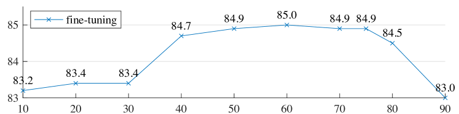
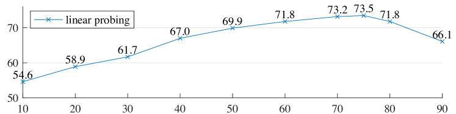

# MAE 详解（Masked Autoencoders Are Scalable Vision Learners）

> He et al., CVPR 2022 (Best Paper Honorable Mention)

## 一句话总结

**把图像 75% 的 patch 遮住，让 ViT 只看剩下 25% 去重建像素**——一个极其简洁的自监督预训练方法。

---

## 1. 动机：为什么 BERT 式遮蔽在视觉里迟迟没成功？

NLP 中 BERT 的 masked language modeling 大获成功，但直接搬到视觉有三个障碍：

| 障碍 | NLP | 视觉 | MAE 的解法 |
|------|-----|------|-----------|
| **架构差异** | Transformer 是标配 | CNN 没有 mask token 概念 | 用 **ViT**，patch = token |
| **信息密度** | 语言高度语义化，遮一个词就丢很多信息 | 图像有大量空间冗余，遮 15% 太简单 | **遮 75%**，逼模型做高层语义理解 |
| **解码目标** | 离散 token，softmax 分类 | 连续像素值 | 直接回归**归一化像素值**（MSE loss） |

---

## 2. 方法

### 2.1 整体流程


*图 1：MAE 架构。预训练时，随机遮蔽大部分图像 patch（如 75%）。Encoder 只处理可见 patch，轻量 Decoder 从潜在表示和 mask token 重建原始图像像素。（图源：原论文 Figure 1）*

```
输入图像
  │
  ▼
切成 N 个 patch（如 14×14 = 196 个）
  │
  ▼
随机 mask 75%，只保留 25% 的 visible patches
  │
  ▼
┌──────────────────────────────────┐
│  Encoder（标准 ViT）              │  ← 只处理 visible patches（约 49 个）
│  加上位置编码                      │
└──────────────────────────────────┘
  │
  ▼
把 [MASK] token 插回被遮的位置，拼成完整序列
  │
  ▼
┌──────────────────────────────────┐
│  Decoder（轻量 Transformer）      │  ← 处理全部 196 个 token
│  8 层，dim=512                    │
└──────────────────────────────────┘
  │
  ▼
对 masked 位置预测像素值（MSE loss）
```

### 2.2 关键设计

#### (1) 非对称 Encoder-Decoder

- **Encoder：大而重** — 标准 ViT-Large/Huge，但只吃 25% 的 token → **计算量降到约 1/4**
- **Decoder：小而轻** — 只在预训练时使用，下游任务丢掉

这是 MAE 训练效率高的核心原因：encoder 不需要处理 mask token。

#### (2) 极高的 mask ratio（75%）

这不是随便选的：

| Mask ratio | ImageNet linear probe acc |
|-----------|--------------------------|
| 25% | ~65% |
| 50% | ~70% |
| **75%** | **~76%（最优）** |
| 90% | ~72% |



*图 5：Mask ratio 消融实验。上图为 fine-tuning 精度，下图为 linear probing 精度。75% 是最优比例。（图源：原论文 Figure 5）*

75% 是一个 sweet spot：
- 太低 → 任务太简单，模型学插值就行，不需要理解语义
- 太高 → 信息太少，无法重建

#### (3) 重建目标：归一化像素值

- 对每个 patch 独立做归一化（减均值除标准差）
- 只对 **masked patches** 计算 MSE loss
- 不用复杂的 tokenizer（对比 BEiT 需要 dVAE）

$$\mathcal{L} = \frac{1}{|\mathcal{M}|} \sum_{i \in \mathcal{M}} \left\| \hat{x}_i - \text{normalize}(x_i) \right\|^2$$

其中 $\mathcal{M}$ 是被 mask 的 patch 集合。

---

## 3. 与其他方法对比

| 方法 | 类型 | 预训练目标 | 是否需要额外模块 | mask ratio |
|------|------|-----------|-----------------|-----------|
| **MAE** | 生成式（MIM） | 像素重建 | ❌ | 75% |
| BEiT | 生成式（MIM） | 离散 token 分类 | dVAE tokenizer | 40% |
| SimMIM | 生成式（MIM） | 像素重建 | ❌ | 60% |
| DINO | 判别式（蒸馏） | 特征一致性 | EMA teacher | N/A |
| MoCo v3 | 判别式（对比） | 对比 loss | momentum encoder | N/A |

### MAE vs 对比学习/DINO

- **对比学习/DINO**：学习**全局不变特征**（augmentation invariance），擅长分类
- **MAE**：学习**局部像素级理解**，擅长密集预测（检测、分割）
- 实践中 MAE 在**大模型 + 大数据**场景优势更明显（scaling 更好）

---

## 4. 实验结果

### 重建效果可视化


*图 2：ImageNet 验证集上的重建示例。每组三张图：遮蔽后的输入（左）、MAE 重建结果（中）、原始图像（右）。即使 75% 的 patch 被遮蔽，MAE 依然能重建出合理的图像结构。（图源：原论文 Figure 2）*


*图 4：用 75% mask ratio 预训练的 MAE，在更高遮蔽率（80%、85%、90%、95%）输入上的重建效果。即使 95% 被遮蔽，模型仍能产生合理的重建。（图源：原论文 Figure 4）*

### ImageNet-1K 分类（fine-tune）

| 模型 | 预训练方法 | Top-1 Acc |
|------|-----------|-----------|
| ViT-B | MAE (1600 ep) | 83.6% |
| ViT-L | MAE (1600 ep) | 85.9% |
| ViT-H | MAE (1600 ep) | **87.8%** |

关键发现：
- MAE 预训练 **不会过拟合**，1600 epoch 还在涨
- **ViT 越大效果越好**，解决了 ViT 在 ImageNet-1K 上数据不够的问题
- 无监督预训练首次在 ImageNet 上超过有监督预训练

### Partial Fine-tuning：特征质量分析


*图 9：ViT-L 的 partial fine-tuning 结果。只微调最后几个 Transformer block 时，MAE 预训练的特征远优于有监督预训练，说明 MAE 学到了更具迁移性的中间层特征。（图源：原论文 Figure 9）*

### 下游任务迁移

- **COCO 检测/分割**：ViT-H MAE → 56.3 box AP（当时 SOTA）
- **ADE20K 语义分割**：同样优于有监督预训练

---

## 5. 为什么 MAE 重要？

1. **证明了 MIM 在视觉中可行**：打破了"视觉需要对比学习"的思维定式
2. **极高的训练效率**：75% mask → encoder 只处理 1/4 token → 比 DINO/MoCo 快 3-4 倍
3. **Scaling 友好**：模型越大越好，不像对比学习容易饱和
4. **简洁**：不需要 data augmentation pipeline、momentum encoder、tokenizer 等额外组件

---

## 6. MAE 的后续扩展

| 变体 | 扩展方向 | 关键改动 |
|------|---------|---------|
| **AudioMAE** | 音频 | 对频谱图做 mask |
| **MultiMAE** | 多模态 | 同时重建 RGB、深度、语义分割 |
| **CAE** | 改进目标 | 用 DALL-E tokenizer 做离散 token 预测 |
| **EVA** | 改进目标 | 用 CLIP feature 作为重建目标（语义更强） |
| **I-JEPA** | 改进思路 | 在 latent space 做预测而非像素空间（LeCun 力推） |

---

## 7. 面试高频问题

**Q：MAE 为什么要遮 75% 这么多？**
> 图像的空间冗余远高于语言。遮 15%（BERT 的比例）模型只需插值邻近像素就能"作弊"，不需要学习高层语义。75% 的极端遮蔽迫使模型理解物体结构和场景语义才能完成重建。

**Q：为什么 encoder 只处理 visible patches？**
> 效率。如果让 encoder 也处理 mask token，计算量会是 4 倍。而 mask token 只需要在轻量 decoder 中参与交互就足够了。

**Q：MAE 和 BERT 的关键区别是什么？**
> (1) Mask ratio：75% vs 15%；(2) 重建目标：连续像素 vs 离散 token；(3) 非对称架构：encoder 只看 visible，BERT 的 encoder 看全部含 [MASK] 的序列。

**Q：MAE 的特征适合什么下游任务？**
> 尤其适合**密集预测任务**（检测、分割），因为预训练目标是像素级重建，学到了丰富的局部特征。对于纯分类任务，DINO/CLIP 的全局特征有时更好。

---

[返回表示学习](README.md) | [返回视觉](../README.md) | [返回总目录](../../README.md)
