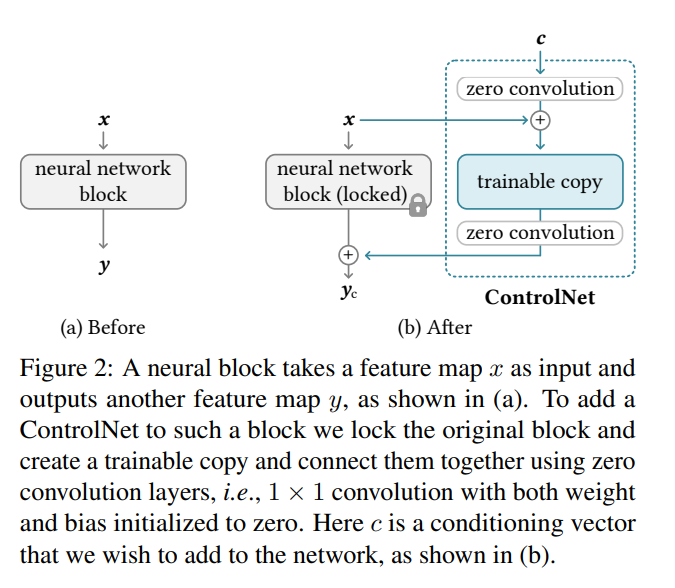
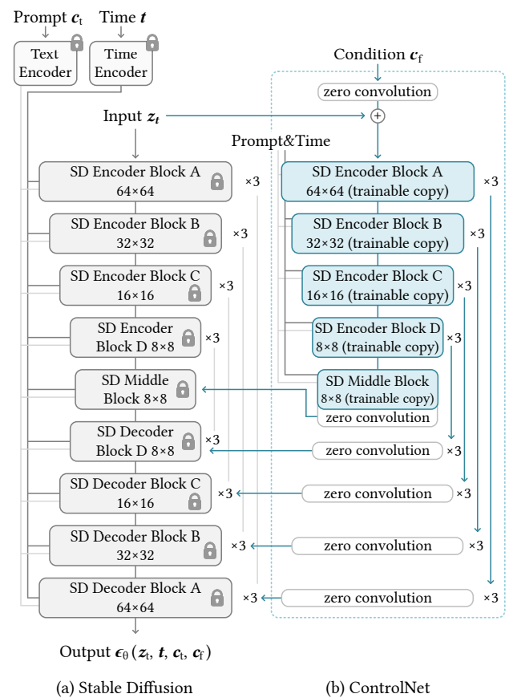

# 2026年1月26号~2026年2月1号 Paper Reading

## Control Net

https://arxiv.org/pdf/2302.05543

**[Deep Dive] ControlNet: 非破坏性适配与特征注入的艺术**

> **论文标题**: Adding Conditional Control to Text-to-Image Diffusion Models
> 
> **核心逻辑**: 拒绝直接修改大模型的神经网络权重，而是采用 **"旁路特征注入" (Side-Network Feature Injection)** 的模式。通过复制模型编码器作为 "可训练副本"，利用 **零卷积 (Zero Convolution)** 进行平滑连接，实现对原始模型的 "无痛" 操控。
> 
> **一句话总结**: 给冻结的 Stable Diffusion 外挂了一个 "神经旁路"，专门负责处理空间结构信息，并通过特征叠加的方式引导生成，完美保留了原模型的 "潜意识" 和泛化能力。

---

**1. 核心哲学：非破坏性适配 (Non-destructive Adaptation)**

这是 ControlNet 与传统微调（Fine-tuning）最本质的区别。

* **传统微调的痛点 (Weight Modification)**:
    * 无论是全量微调还是 Dreambooth，本质上都是在修改 U-Net 的权重 $W$ ($W_{new} = W_{old} + \Delta W$)。
    * **风险**: 这是一种 "脑部手术"。为了学会新的边缘控制，模型可能会 "灾难性遗忘" (Catastrophic Forgetting) 它原本学到的光影、纹理或画风。过拟合风险极高，泛化性大幅下降。

* **ControlNet 的解法 (Feature Injection)**:
    * 它**完全锁死**了原始 SD 模型的权重 (Locked Copy)。
    * 它**不改变**大模型原本的思考回路，而是通过在中间层 **注入 (Inject)** 额外的特征向量来改变生成的走向。
    * **公式逻辑**:
        $$Feature_{final} = \text{Block}_{locked}(x) + \text{ZeroConv}(\text{Block}_{trainable}(x + c))$$
    * **优势**: 原始模型 (Locked Copy) 就像一个阅图无数的 "老画家"，保留了所有的语义知识（画风、物体概念）；ControlNet (Trainable Copy) 就像一个 "透视辅助线"，只负责提供结构约束。两者分工明确，互不干扰。

---

**2. 架构设计：Sidecar (边车/旁路) 模式**

ControlNet 并没有把新模块 "串联" 进网络，而是 "并联" 了一个克隆体。

* **Locked Copy (语义大脑)**:
    * 直接复用 Stable Diffusion 的 Encoder 和 Middle Block。
    * **状态**: Freeze (冻结)。在训练过程中梯度不更新。
    * **作用**: 保证生成图像的质量、纹理和风格与原版 SD 一致。

* **Trainable Copy (结构眼睛)**:
    * 这是 Locked Copy 的完全克隆。
    * **状态**: Trainable (可训练)。
    * **输入**: 除了 Latent Noise，还额外接收 **Condition Vector** (如 Canny 边缘图、Pose 骨架图)。
    * **作用**: 专门学习如何提取控制信号中的几何/结构特征。

* **Feature Fusion (特征融合)**:
    * Trainable Copy 计算出的特征，会**跨越**层级，以残差 (Residual) 的形式 **相加 (Add)** 到 Locked Copy 的 Decoder 部分。
    * 这意味着控制信号是 "叠加" 在原有语义特征之上的，而不是 "替换" 它们。

---

**3. 关键算子：零卷积 (Zero Convolution)**

这是实现 "不破坏初始状态" 的工程核心。

* **定义**: 一个 $1 \times 1$ 的卷积层，其权重 $W$ 和偏置 $B$ 全部初始化为 **0**。
* **数学魔法**:
    $$y = W \cdot x + B$$
    * 在训练的 Step 0: 因为 $W=0, B=0$，所以输出 $y=0$。
    * **等价性**: 此时，$\text{Locked Copy} + 0 = \text{Original SD}$。
* **物理意义**:
    * **平滑启动 (Warm Start)**: 即使 Trainable Copy 是随机初始化的，输出的一堆乱七八糟的特征在经过 Zero Conv 后都变成了 0。这意味着训练刚开始时，**主网络完全感知不到 ControlNet 的存在**。
    * **避免崩坏**: 这防止了微调初期常见的 "特征空间污染"，保护了预训练模型的分布不被破坏。
    * **渐进式接管**: 随着反向传播，Zero Conv 的权重逐渐变成非 0，控制信号才一点点地 "渗透" 进主网络，实现平滑过渡。

---

**4. 为什么 "特征注入" 优于 "参数修改"？**

回到您的观点，这种设计在工业落地中具有决定性优势：

* **避免过拟合 (Avoid Overfitting)**:
    * 因为 ControlNet 只需要学习 "边缘 $\to$ 轮廓" 这种简单的几何映射，而不需要学习 "什么是猫"，所以它在极小的数据集上（比如几千张）就能收敛，且不会因为数据少而过拟合出奇怪的纹理。

* **泛化能力的解耦 (Decoupled Generalization)**:
    * **案例**: 你用真实照片的 Canny 边缘训练了 ControlNet。
    * **推理**: 你可以使用 "油画风格" 的 Prompt 配合这个 ControlNet。
    * **结果**: 模型能画出油画风格的图，且构图严格遵循 Canny 边缘。
    * **原因**: "油画风格" 是由冻结的 Locked Copy (原模型) 提供的，它没被破坏；"边缘构图" 是由 ControlNet 提供的。这种 **语义与结构的解耦**，是传统微调很难做到的。

---

**5. 总结：工程美学的胜利**

ControlNet 的成功不仅在于它解决了控制问题，更在于它提出了一种 **"对预训练大模型表示尊重"** 的微调范式。

它证明了：想要利用大模型的能力，不需要去 "重塑" 它的大脑（修改权重），只需要给它 "戴上一副眼镜"（特征注入）。通过 **零卷积** 这一精妙的初始化技巧，它连接了 "确定的控制条件" 和 "生成的发散空间"，成为了 AI 绘画领域最重要的基础设施之一。