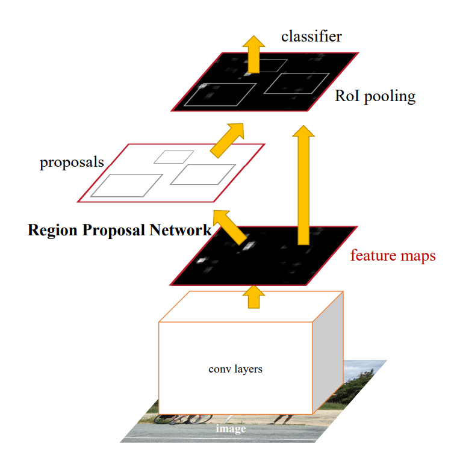

# 2026年1月12号~2026年1月18号 Paper Reading

## Faster R-CNN

https://arxiv.org/abs/1506.01497

这篇文章是2D 检测任务的里程碑。对于一张输入图片，首先经过conv layers，得到feature map。然后在feature map使用RPN生成候选框，然后用RoI Pooling 提取特征，经过classifier 输出分类类别以及一个额外的候选框偏离值，进行二次精修。

**RPN：**

RPN 是一个基于“滑动窗口”思想的轻量级全卷积网络，它的本质是在特征图上进行密集的预筛选。它不关心物体具体是谁，只关心“这里有没有东西”以及“大致位置在哪”。它利用 CNN 的感受野机制，在特征图的每一个像素点上，预设了 $k$ 个不同比例和大小的锚框（Anchors），通过卷积直接回归出这 $k$ 个框的偏移量（Deltas）和前景/背景概率。实现了与 Backbone 的卷积特征共享使得它的检测速度能提升到毫秒级。

>Input: Backbone 输出的特征图（如 $H \times W \times 256$）。
>
>Operation: 用一个 $3 \times 3$ 的卷积核在特征图上滑动。
>
>Output: 每个位置输出 $2k$ 个分数（前景/背景概率）和 $4k$ 个坐标（$x, y, w, h$ 的偏移量）。
>
>Selection: 也就是 NMS（非极大值抑制），从成千上万个 Anchors 中筛出 Top-N 个（如 2000 个）作为 Proposals。
>
>Translation Invariant: 利用卷积的平移不变性，不管物体在哪都能扫到。

**RoI Pooling：**

RoI Pooling 是一个粗糙的离散化转换器。它的任务是将 RPN 找出来的、大小不一的候选框，强制转换成固定尺寸（如 $7 \times 7$）的特征块，以便喂给后面的全连接层（FC）。它的核心逻辑是“量化取整”，即把浮点数坐标强行扔掉小数部分。这种操作对于分类任务（Translation Invariant）是可接受的，但对于像素级任务（Pixel-wise Prediction）是破坏性的，因为它丢失了亚像素级的空间对齐信息。

>Mapping: 将原图 ROI 坐标除以 Stride（如 16），得到特征图坐标（浮点数）。
>
>Quantization 1: 将浮点坐标四舍五入为整数（第一次精度丢失）。
>
>Binning: 将量化后的区域划分为 $7 \times 7$ 个网格。如果除不尽，再次取整（第二次精度丢失）。
>
>Pooling: 在每个网格内取 Max 值。
>
>Misalignment: 两次取整导致的坐标偏移，在映射回原图时会被放大（Stride 倍），导致 Mask 和物体对不上。

## Mask R-CNN

https://arxiv.org/abs/1703.06870

为了解决上述的RoI Pooling 会导致的检测框偏移的问题，Mask R-CNN 提出了RoI Aligned 的方法，通过双线性插值来避免取整操作，将特征视为连续的平面进而直接插值得到所有位置的特征。Mask R-CNN 额外提供了一个 mask 分割头，不仅输出检测框，还同时对 mask 进行了prediction，避免了 two stage 的分割操作。

**RoI Align**

RoI Align 是为了修复 RoI Pooling 的量化误差而生的连续空间采样器。它放弃了离散的网格思想，将特征图视为连续的平面。它完全保留 RPN 输出的浮点数坐标，通过双线性插值（Bilinear Interpolation） 根据邻近的 4 个真实像素点，计算出虚拟采样点的精确数值。它保证了特征提取的几何位置与原图完全一致，是实例分割能达到高精度的物理基础。

>No Quantization: 坐标全程保持浮点数（如 $2.55$ 不会变成 $3$）。
>
>Sampling: 在每个 Bin（如 $2 \times 2$）内均匀设定 4 个采样点。
>
>Interpolation: 对每个采样点，通过周围 4 个特征像素做双线性插值计算其值。
>
>Aggregation: 取 4 个点的最大值或平均值作为该 Bin 的输出。
>
>Pixel-level Alignment: 彻底消除了坐标量化误差，大幅提升了小物体检测和分割精度（Mask AP 提升显著）。

**Mask Branch (FCN Head)**

这是 Mask R-CNN 的“生成器”。它采用全卷积网络（FCN）结构，核心思想是“维护空间结构”。不同于分类分支把特征拍扁（Flatten）成向量，Mask 分支一直保持 $m \times m$ 的矩阵形式，通过卷积和反卷积（Deconv）操作，利用特征图的空间布局信息，直接预测出该 ROI 内每个像素属于物体的概率。它采用了“解耦”策略，为每个类别独立预测一个二进制 Mask，避免了类间竞争。

>Input: RoI Align 输出的特征（如 $14 \times 14$）。
>
>Layers: 连续的 Conv 层保持分辨率 $\to$ Deconv 层上采样 $\to$ $1 \times 1$ Conv 输出 $K$ 个通道。
>
>Target: 输出 $K \times 28 \times 28$ 的矩阵。
>
>Inference: 根据分类分支的 Label ID，只取对应的那一张 Mask 图。
>
>FCN vs MLP: 实验证明 FCN 这种保留空间维度的结构比全连接层（MLP）效果好得多。

## Mask Scoring R-CNN

https://arxiv.org/abs/1903.00241

**MaskIoU Head** 

这是针对 Mask R-CNN “盲目自信”问题的质量回归模块。Mask R-CNN 的检测逻辑默认 “分类分越高 $\approx$ Mask 质量越好”。然而，分类的置信度与预测的IoU并不能等价，分类置信度高的 Mask 结果不一定好，IoU可能反而更低。

为此，作者引入了一个新的分支 Mask IoU Head 来进行二次打分，共同评估分割的mask和置信度分数。

在 Mask 生成之后，将“特征图”与“生成的 Mask”拼接在一起，通过回归网络预测该 Mask 与 Ground Truth 的真实 IoU。它的作用是重排序（Re-ranking）：如果一个检测框分类分很高，但 Mask 画得很烂，这个模块会预测出一个低 IoU 分数，从而拉低最终的置信度，防止烂结果“骗”过评价指标。需要注意训练时，阻断梯度回传给 Mask Branch（防止 Mask Branch 为了迎合评分而作弊）。

Score: $S_{final} = S_{cls} \times S_{iou}$。

解决了分类置信度与分割质量不匹配的问题。

## PointRend

https://arxiv.org/abs/1912.08193

尝试解决插值导致的分割时候的 deconv 上采样的边缘细节精度问题。

为此，提出了在边缘和遮挡位置进行更加精细的专门计算，额外挂一个单独的 mlp 预测头对边缘进行调优。

先把当前低分率图（$28 \times 28$）直接双线性插值放大 2 倍（$56 \times 56$）。这时候边缘是虚的。

计算每个像素的置信度。如果一个点预测是“前景”的概率是 0.99，或者是“背景”的概率是 0.01，说明模型很确定，这种点不用管。如果概率接近 0.5，说明是边缘，模型很纠结。

选出 Top-N 个这种“最不确定”的点。对于这 N 个难点，回到 Backbone 的高分辨率特征图（Fine-grained features）上去抠特征（类似 RoI Align）。同时拿到当前的粗略预测结果（Coarse prediction）。把这两种特征拼起来。

用一个极小的 MLP（其实就是几个 $1 \times 1$ 卷积）专门处理这 N 个点，重新预测它们的分类。把算出来的新值填回去。相当于去对每一个点的feature，用一个共享的MLP去进行精细调优，修复插值。

重复上述步骤，直到达到目标分辨率。

## Mask Transfiner

https://arxiv.org/pdf/2111.13673

PointRend 的局限：它对每个难点像素的预测是独立的（Point-wise MLP）。它只能修复边缘，但无法修复破碎和断裂的区域。

我们希望解决高频细节中的结构一致性。

**核心痛点与动机：打破“分辨率-算力”的死结**

实例分割长期面临一个两难困境：要获得锐利的物体边界，必须在高分辨率特征图上计算，但 $O(H \times W)$  的计算量和显存随分辨率平方级增长，导致现有方法（如 Mask R-CNN）只能在  $28 \times 28$ 的低分图上妥协，造成 mask 边缘模糊。本文的**核心工程突破**在于，它并未试图降低全图计算的复杂度，而是利用图像的**空间稀疏性**，将计算算力精准地“外科手术式”集中在仅占全图极小比例的误差易发区域。

**核心机制：不连贯区域检测与四叉树建模**

文章并未采用通用的边缘检测，而是定义了 **"Incoherent Regions"（不连贯区域）** ——即那些经过下采样再上采样后无法还原的信息丢失区域。

逻辑： 如果一个掩码 $M_{l-1}$ 在下采样后再上采样无法还原，说明该区域包含高频信息，是“不连贯”的。

$$D_l = O_{\downarrow}(M_{l-1} \oplus S_{\uparrow}(S_{\downarrow}(M_{l-1})))$$

为了高效存储这些稀疏点并保留多尺度上下文，作者引入了 **Quadtree（四叉树）** 结构：平滑背景作为粗粒度叶子节点不再分裂，而高频不连贯区域则递归分裂至最高分辨率。这种数据结构本质上是对特征图的一种**自适应有损压缩**，极大地节省了显存。

**计算范式：Transformer 序列化处理**

Mask Transfiner 将四叉树上活跃的稀疏节点 Flatten（压扁）成一个 **1D 序列**，并在显式注入 **Positional Embedding** 后，直接送入 Transformer 进行处理。利用 Transformer 的全局注意力机制（Self-Attention），让边缘像素不仅能利用局部纹理，还能跨越空间捕捉长距离的语义依赖，从而修正错误的分割预测。

本质上，这是一个用 **“显存访问的复杂度”** 换取 **“计算密度的有效性”** 的交换。通过放弃 Dense Tensor 的规则内存布局，模型获得了处理超大分辨率（如  甚至更大）Mask 的能力，且 FLOPs 极低。这在显存受限但需要极致精度的场景（如高清抠图）是巨大的优势。