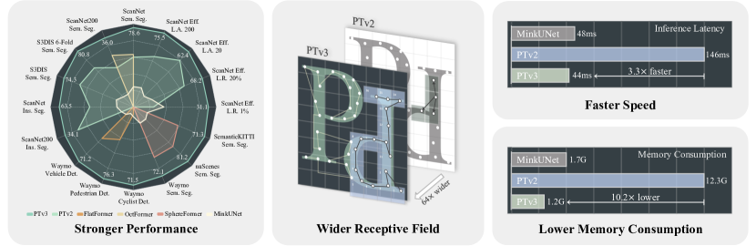
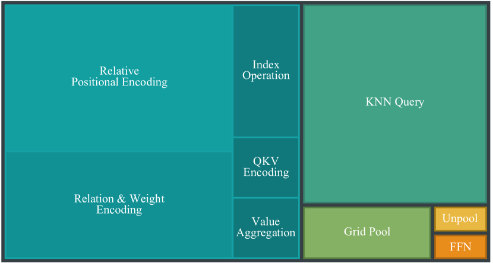

# 2026年1月19号~2026年1月25号 Paper Reading

## PointTransformer

https://arxiv.org/abs/2012.09164

> **论文标题**: Point Transformer
> 
> **核心贡献**: 提出针对 3D 点云特性的 **Point Transformer Layer**，利用 **向量注意力 (Vector Attention)** 和 **相对位置编码** 实现了 SOTA 性能。
> 
> **关键词**: 3D Point Cloud, Vector Attention, Relative Position Encoding, U-Net Architecture

**一、 背景与痛点：为什么需要 Point Transformer？**

在 PTv1 出现之前，3D 点云处理主要面临两个极端：

1.  **体素化 (Voxelization)**: 强行把点云变成规则网格（类似像素），计算量随分辨率立方级增长，且丢失细节。
2.  
3.  **PointNet 系列**: 直接处理点，但对局部几何特征的提取能力有限。

**PTv1 的核心洞察**：

**自注意力机制 (Self-Attention)** 本质上是一个**集合算子 (Set Operator)**，具有“排列不变性” (Permutation Invariance)。这与点云“无序集合”的物理特性完美契合。

---

**二、 核心算子：Point Transformer Layer**

这是全篇的灵魂。作者并没有直接照搬 NLP 里的 Standard Attention，而是针对 3D 空间做了深度定制。

1. 核心公式 (The Formula)

$$
y_i = \sum_{x_j \in \text{kNN}(i)} \rho \Big( \underbrace{\gamma(\varphi(x_i) - \psi(x_j) + \delta)}_{\text{Attention Branch}} \Big) \odot \Big( \underbrace{\alpha(x_j) + \delta}_{\text{Feature Branch}} \Big)
$$

* **局部性**: 只计算 $k$ 近邻 (kNN)，降低计算量。
* **减法关系**: 使用 $\varphi(x_i) - \psi(x_j)$ 而非点积。在几何空间中，**差值**比**夹角**更能描述相对关系。
* **双重位置注入**: $\delta$ 同时加在了注意力生成和特征变换中。

2. 技术高光：向量注意力 vs. 标量注意力

这是 PTv1 最“反直觉”也最有效的设计，也是它区别于标准 Transformer 的地方。

| 特性         | 标量注意力 (Scalar / Standard)           | 向量注意力 (Vector / PTv1)           |
| :----------- | :--------------------------------------- | :----------------------------------- |
| **权重维度** | **标量 (1D)**                            | **向量 (C-dim)**                     |
| **数学操作** | 标量乘法 (Broadcast)                     | **哈达玛积** ($\odot$, Element-wise) |
| **通道控制** | **打包捆绑**。所有特征通道共用一个权重。 | **精准解耦**。每个通道有独立的权重。 |
| **物理意义** | 调节“总音量”。                           | **多频段均衡器 (EQ)**。              |

* **深度解析**：
    * 在 **Scalar Attention** 中，如果邻居 $j$ 的权重是 0.5，那么它的颜色、纹理、几何特征都要 $\times 0.5$。特征内部的相对比例（Ratio）**保持不变**。
    * 在 **Vector Attention** 中，模型可以生成权重向量 `[0.9, 0.1, ...]`。这意味着模型可以**高亮**该点的几何特征（Channel 0），同时**抑制**该点的颜色噪音（Channel 1）。特征内部的比例被**重组**了。
    * **结论**：这对 3D 点云至关重要，因为几何特征往往是高度解耦（正交）的。

**3. 相对位置编码 (Relative Position Encoding)**

PTv1 不使用绝对坐标，而是关注 **“我在你的哪里”**。

* **公式**: $\delta = \theta(p_i - p_j)$
* **实现**: 将坐标差输入到一个 MLP（两层 Linear + ReLU），映射为高维特征。
* **关键细节**: 位置编码 $\delta$ 被加了两次。
    1.  **Attention Branch**: 决定“我看你清不清晰”（位置即权重）。
    2.  **Feature Branch**: 决定“传过去什么信息”（位置即特征）。

---

**三、 网络架构：3D 版的 U-Net**


PTv1 依然沿用了经典的 **Encoder-Decoder** 结构，但在上下采样环节做了特殊设计。

1. 残差模块 (Residual Block)

遵循 **ResNet** 的设计哲学：$y = F(x) + x$。

* **结构**: `Linear` $\to$ `PT Layer` $\to$ `Linear` $\to$ `Add`。
* **原理**: 创造**梯度高速公路**。即使网络很深，梯度也能通过 `+1` 的路径无损回传，解决退化问题。

1. 下采样 (Transition Down)

* **目标**: 点数减少 ($N \to N/4$)，特征维度增加。
* **流程**:
    1.  **FPS (最远点采样)**: 选出分布均匀的中心点。
    2.  **kNN**: 在老点集中找邻居。
    3.  **Local Max Pooling**: 聚合邻居特征（提取局部显著特征）。
* *Note: 这里没有用 Strided Convolution，而是用 FPS+Pooling 代替。*

3. 上采样 (Transition Up)

* **目标**: 点数恢复 ($N/16 \to N/4$)，用于稠密预测。
* **流程**:
    1.  **Linear**: 特征变换。
    2.  **Trilinear Interpolation**: 三线性插值，找高分辨率下的 3 个最近邻进行加权。
    3.  **Summation**: 与 Encoder 层的特征**相加**（Skip Connection）。

---

*历史地位与演进 (PTv1 vs. PTv3)*

* **PTv1 (理想主义)**:
    * 追求极致的几何表达能力。
    * 使用 **Vector Attention** (减法+MLP)。
    * **缺点**: 算子不标准，无法利用 GPU 加速，显存占用大，速度慢。

* **PTv3 (工程主义)**:
    * 追求极致的效率和规模。
    * **倒车**: 放弃 Vector Attention，改回 **Scalar Dot-Product Attention**。
    * **原因**: 为了适配 **FlashAttention**。
    * **补偿**: 通过 **Z-Order 排序** 和 **Patch** 机制扩大感受野。用“大力出奇迹”（更深的网络、更快的数据吞吐）来弥补单层表达能力的下降。

## Swin Transformer

https://arxiv.org/abs/2103.14030

> **论文标题**: Swin Transformer: Hierarchical Vision Transformer using Shifted Windows
> 
> **核心贡献**: 解决了 Transformer 在高分辨率图像上的计算瓶颈，引入 **“滑动窗口 (Shifted Window)”** 机制，构建了像 CNN 一样的 **金字塔 (Hierarchical)** 结构。
> 
> 通过“分治法”将计算复杂度从平方级 $O(N^2)$ 降为线性级 $O(N)$。

---

**一、 核心痛点：ViT 为什么不够好？**

**Vision Transformer (ViT)** 虽然将 Transformer 引入了视觉领域，但它有两个致命弱点，使其难以胜任检测（Detection）和分割（Segmentation）任务：

1.  **直筒子结构 (Columnar)**: 输出特征图的分辨率始终不变（通常是 1/16）。缺乏 CNN 那种多尺度的特征金字塔，难以捕捉不同大小的物体。
2.  **计算量爆炸**: 采用全局注意力 (Global Attention)。
    * 复杂度：$O(N^2)$。
    * 后果：图像分辨率翻倍，计算量翻 4 倍。对于 $800 \times 800$ 的大图，显存直接溢出。

---

**二、 核心机制：Shifted Window (滑动窗口)**

Swin 的核心哲学是 **"Divide and Conquer" (分而治之)**。它通过成对出现的 Block (**W-MSA** 和 **SW-MSA**) 来平衡效率与全局信息。

**1. W-MSA (Window Attention) —— "各扫门前雪"**

* **做法**: 将图片切成固定大小的窗口（例如 $7 \times 7$ 个 Patch 为一个窗口）。Attention 只在**窗口内部**计算。
* **收益**: 计算复杂度降低为 **线性 $O(N)$**。
* **代价**: 窗口之间**断联**（孤岛效应），信息无法流通。

**2. SW-MSA (Shifted Window Attention) —— "串门"**

* **做法**: 在下一层，将窗口划分的位置向右下角移动（Shift）窗口尺寸的一半。
* **原理**:
    * **破壁**: 上一层窗口的“边界”，变成了这一层窗口的“中心”。
    * **融合**: 原本不属于同一个窗口的 Patch，现在被框在了一起进行交互。
* **堆叠效应**: 通过多层堆叠，信息像接力赛一样传遍全图，实现等效的**全局感受野**。

**3. 工程黑魔法：Cyclic Shift + Mask**

为了解决 Shift 后窗口大小不一（边缘破碎）导致无法并行计算的问题，Swin 采用了精妙的工程实现：

1.  **循环位移 (Cyclic Shift)**: 把移出边界的像素“卷”回到对面的边界，硬凑成整齐的窗口。

2.  **Mask (掩码)**: 因为“卷”回来的像素在原图中其实相隔很远，不能算 Attention。使用 Mask 将这些位置的权重设为 `-inf`，强制阻断交互。

---

**三、 宏观架构：4-Stage 金字塔**

Swin 模仿了 ResNet 的结构，随着网络加深，特征图越来越小，通道数越来越多。

**1. 结构概览**


整个网络分为 4 个 Stage。除了 Stage 1 是 Patch Embedding，后续每个 Stage 的开头都是 **Patch Merging**。

| Stage       | 操作                  | 效果 (类比 CNN)  | 输出分辨率   |
| :---------- | :-------------------- | :--------------- | :----------- |
| **Stage 1** | Patch Partition (4x4) | 初始特征提取     | $H/4, W/4$   |
| **Stage 2** | **Patch Merging**     | 下采样 (Pooling) | $H/8, W/8$   |
| **Stage 3** | **Patch Merging**     | 主力特征提取     | $H/16, W/16$ |
| **Stage 4** | **Patch Merging**     | 高层语义整合     | $H/32, W/32$ |

***2. Patch Merging (下采样)***

* **作用**: 替代 CNN 中的 Stride=2 卷积或池化。
* **操作**: 取相邻的 $2 \times 2$ 个 Patch，将它们的特征拼接到一起（Concat），然后通过 Linear 层降维。
* **结果**: 图像高宽减半，通道数翻倍（$C \to 2C$）。

***3. 深度配置 (Depth Configuration)***

Swin 的 Block 必须是**成对**堆叠的 (Tick-Tock)。
以 **Swin-Tiny** (对标 ResNet-50) 为例，配置为 `[2, 2, 6, 2]`：
* **Stage 1 & 2**: 浅层特征 (2层)。
* **Stage 3**: **黄金 C 位** (6层，Base 版甚至有 18 层)。绝大部分算力集中在这里处理 1/16 分辨率的特征。
* **Stage 4**: 收尾 (2层)。

---

**四、 Swin Transformer vs. ViT**

| 维度               | ViT (Vision Transformer) | Swin Transformer                 |
| :----------------- | :----------------------- | :------------------------------- |
| **Attention 范围** | **Global** (全图互算)    | **Local** (窗口内算)             |
| **跨区域交互**     | 一步到位                 | 靠 **Shift Window** 多层传递     |
| **复杂度**         | **$O(N^2)$** (平方级)    | **$O(N)$** (线性级)              |
| **位置编码**       | 绝对位置编码 (Add)       | **相对位置编码** (Bias)          |
| **特征图**         | 直筒子 (分辨率不变)      | 金字塔 (逐层降采样)              |
| **适用性**         | 图像分类                 | **密集预测 (分割、检测)** + 分类 |

---

**五、 启示录：从 Swin 到 PTv3**

理解 Swin 是理解现代 3D Backbone (如 PTv3) 的钥匙。

* **思想继承**: PTv3 本质上是将 3D 点云通过 **Z-Order** 拍扁成 1D 序列后，强行套用的 Swin Transformer。
* **对应关系**:
    * Swin 的 **Window** $\Leftrightarrow$ PTv3 的 **Patch** (Z-Order 切片)。
    * Swin 的 **Shift Window** $\Leftrightarrow$ PTv3 的 **Serialization + Sparse Conv** (解决边界断联)。
* **进化**: PTv3 嫌弃 Swin 的 Shift+Mask 代码太慢太繁琐，改用了更适合 GPU 并行的 **FlashAttention** + **CPE (Sparse Conv)** 来达到同样的信息流通目的。

---
*Notes created for Engineering Review.*

## Point Transformer V3

https://arxiv.org/abs/2312.10035

**[Deep Dive] Point Transformer V3: 工业级 3D 骨干网络的工程复盘**

> **论文标题**: Point Transformer V3: Simpler, Faster, Stronger
> 
> **核心逻辑**: 彻底放弃学术界对 "几何精细度 (Inductive Bias)" 的执念，全面拥抱 **Scale (规模)**。通过 **Z-Order 序列化** 将无序点云转化为有序序列，利用 **FlashAttention** 和 **Sparse Convolution** 的组合，实现了效率与精度的双重 SOTA。
> 
> **核心映射**: 可以将其理解为 **"3D 点云版的 Swin Transformer"**，但针对 GPU 硬件特性进行了极致的减法和优化。

---

**1. 演进史：从“精雕细琢”到“大力出奇迹”**

* **PTv1 / PTv2 (学术派)**:
    * **核心算子**: K-NN (找邻居) + Vector Attention (向量减法 + MLP)。
    * **痛点**:
        * **显存碎片化**: K-NN 导致随机内存访问 (Random Access)，IO 效率极低。
        * **无法加速**: Vector Attention 无法利用 NVIDIA 优化的 FlashAttention Kernel。
        * **感受野受限**: 也就是 16~32 个点，无法捕捉长距离语义。
* **PTv3 (工程派)**:
    * **核心算子**: Serialization + FlashAttention + Sparse Conv。
    * **破局策略**:
        * **放弃 K-NN**: 用排序 (Sorting) 代替搜索 (Searching)。
        * **放弃 Vector Attn**: 回归标准的 Dot-Product Attention ($QK^T$)，利用 FlashAttention 将速度提升 3-10 倍。
        * **扩大规模**: 用节省下来的显存堆叠网络深度 (Stage 3 堆 18+ 层) 和感受野 (1024+ 点)。

---

**2. 核心基石：序列化 (Serialization) 与 Patching**

这是 PTv3 能够并行的物理基础。

* **原理: Z-Order Curve (Morton Code)**
    * 利用 **位交叉 (Bit Interleaving)** 将 3D 坐标 $(x, y, z)$ 压缩为 1D 整数。
    * `Code = z_bit | y_bit | x_bit` (递归交叉)。
    * `Index = Argsort(Code)`。
* **操作: Patch Partition (切片)**
    * 排序后，点云在内存中变得相对连续。
    * 直接按索引切分：`Patch_i = Points[i*1024 : (i+1)*1024]`。
    * **优势**: 极速，零搜索成本。
    * **缺陷 (Jumps)**: Z-Order 曲线存在突变，序列中相邻的点在 3D 空间中可能相隔很远 (边界断裂问题)。这需要 xCPE 来修复。

---

**3. Block 微观架构：Pre-Norm & xCPE**

PTv3 的 Block 采用了 **Pre-Norm** 结构以支持深层训练。其内部的数据流向经过了精心设计：

**流水线**: `Input` $\to$ **xCPE** $\to$ `LayerNorm` $\to$ **FlashAttention** $\to$ `Add` $\to$ `LayerNorm` $\to$ `MLP` $\to$ `Add`

* **关键组件 A: xCPE (Enhanced Conditional Positional Encoding)**
    * **本质**: **Depth-wise Sparse Convolution ($3\times3\times3$)**。
    * **位置**: **必须在 Attention 之前**。
    * **作用**:
        1.  **注入几何位置**: Attention 只有语义没有几何感，Sparse Conv 提取局部几何特征并融合进 Channel。
        2.  **缝合边界**: 修复 Z-Order 序列化带来的空间跳跃，让特征在进入 Attention 前就感知到真正的 3D 邻居。
    * **特性**: 权重**不共享**。每个 Block 的 xCPE 都是独立的参数，分别提取不同层级的几何特征。

* **关键组件 B: FlashAttention**
    * **本质**: 标准的点积注意力。
    * **变化**: 放弃了 RPE (相对位置编码 Bias)，因为位置信息已经在上一步通过 xCPE 烧录进 $Q, K, V$ 了。

---

**4. Swin Transformer 的 3D 投影与对应**

PTv3 深度借鉴了 Swin 的 "Divide and Conquer" 思想，但在实现上做了 3D 适配。

| 模块         | Swin Transformer (2D)         | Point Transformer V3 (3D) | 核心机制差异                                                                                         |
| :----------- | :---------------------------- | :------------------------ | :--------------------------------------------------------------------------------------------------- |
| **局部划分** | **Window Partition**          | **Patch Grouping**        | Swin 切方块；PTv3 切 Z-Order 序列段。                                                                |
| **跨窗交互** | **Shifted Window**            | **Shuffle Order**         | Swin 物理移动窗口；PTv3 **随机更换排序曲线** (Z-Order $\leftrightarrow$ Hilbert)，改变切片邻居关系。 |
| **位置编码** | **Relative Bias** (Attn 内部) | **xCPE** (Attn 之前)      | 移出 Attention 以适配 FlashAttention 加速库。                                                        |
| **下采样**   | **Patch Merging**             | **Grid Pooling**          | 3D 稀疏数据的特定池化方式。                                                                          |

* **Shuffle Order 实现细节**:
    * 预先计算好多种曲线 (Z, Trans-Z, Hilbert) 的索引。
    * 在每一层 Block 之前，随机选择一种索引进行 `Gather` 重排。
    * 目的：防止模型过拟合某一种特定的序列模式，让感受野覆盖全图。

---

**5. 宏观架构与反直觉的 Normalization**

采用 4-Stage U-Net 结构 (Encoder-Decoder)。

* **Encoder (下采样)**:
    * **Grid Pooling**: 网格大小翻倍 ($0.02m \to 0.04m$)，合并网格内的点 (Max Pool)。
    * **Normalization**: **Batch Norm (BN)**。
        * *Why BN?* Max Pooling 会筛选极端值，导致特征分布剧烈偏移。LayerNorm 无法处理这种 Batch 级别的分布漂移，必须用 BN 强行拉回正态分布。
    * **Block**: 内部使用 **LayerNorm (LN)**，因为序列长度不定，且为了适应 Pre-Norm 结构。

* **Decoder (上采样)**:
    * **策略**: **Simpler is Better**。
    * **Step 1: Grid Unpooling (查表复制)**:
        * 放弃了昂贵的三线性插值。
        * 直接将低分辨率大格子的特征，**Broadcast (复制)** 给属于该格子的所有高分辨率小点 (Nearest Neighbor)。
        * *此时，局部点特征是完全相同的。*
    * **Step 2: Skip Connection (Add)**:
        * 加上 Encoder 传过来的高分辨率特征。
        * *此时，点特征因 Encoder 的细节不同而瞬间区分开。*
    * **Step 3: Decoder Block (Repair)**:
        * 通过 **xCPE (Sparse Conv)** 再次提取局部几何关系，平滑“复制”带来的锯齿。
        * 通过 **Attention** 重新对齐语义。

---

**6. 总结：PTv3 为什么能赢？**

PTv3 的胜利不是算法复杂度的胜利，而是 **System Design (系统设计)** 的胜利。

1.  **Don't fight the hardware**: 既然 GPU 讨厌随机访问，那就用序列化把数据排整齐；既然 Tensor Core 喜欢大矩阵乘法，那就用 FlashAttention。
2.  **Trade-off 的艺术**:
    * 用 **Serialization** 的高效率，换取了 **K-NN** 的高精度 (然后用 xCPE 补回来)。
    * 用 **Unpooling** 的简单复制，换取了 **插值** 的计算时间 (然后用 Skip Connection 补回来)。
3.  **Scale is all you need**: 极低的显存占用意味着可以训练更大的 Batch Size，更深的网络 (ResNet-152 级别)，这在 3D 点云领域是降维打击。

-----

# Point Transformer V3 (PTV3) 完整详解

> 本文是对 PTV3 架构的深入解析，涵盖设计思想、每个模块的具体实现，以及关键设计决策背后的原因。

---

## 1. 核心设计哲学

PTV3 的核心观点是：**用规模换精度**。

与其追求复杂精巧的局部注意力机制，不如简化结构、扩大模型规模，让数据和参数量来提升性能。这一思想贯穿整个架构设计。

---

## 2. 整体架构

模型采用 **U-Net 式的编码器-解码器结构**：



> 图源: *Point Transformer V3: Simpler, Faster, Stronger*, Figure 1. 展示了 Serialization → Embedding → 多 Stage (Grid Pool + Shuffle Orders + Block×N) 的 U-Net 编码器-解码器结构。



> 图源: *Point Transformer V3*, Figure 2. 每个 Block: xCPE (Sparse Conv) → LayerNorm → Serialized Attention → LayerNorm → MLP，均带残差连接。

---

## 3. 各模块详解

### 3.1 Serialization（序列化）

**目的**：将无序点云转换为有序序列，为后续的窗口划分做准备。

**具体做法**：

1. 将连续坐标离散化到网格：`voxel_idx = floor(coord / voxel_size)`
2. 计算空间填充曲线的编码（Z-order / Hilbert）
3. 按编码值排序，得到排列顺序
4. 预先计算多种顺序存起来备用

**Z-order (Morton Code) 原理**：

将 (vx, vy, vz) 的二进制位交错：

```
例如: vx=2(10), vy=3(11), vz=1(01) 
→ 交错后: z_code = 011011
```

**代码示意**：

```python
def z_order_encode(coords, voxel_size):
    # 离散化
    voxel_coords = (coords / voxel_size).int()  # (N, 3)
    
    # Morton 编码
    x, y, z = voxel_coords[:, 0], voxel_coords[:, 1], voxel_coords[:, 2]
    code = 0
    for i in range(21):
        code |= ((x >> i) & 1) << (3*i)
        code |= ((y >> i) & 1) << (3*i + 1)
        code |= ((z >> i) & 1) << (3*i + 2)
    
    # 排序
    order = torch.argsort(code)
    return order
```

---

### 3.2 Embedding（嵌入）

**目的**：将点的原始特征映射到高维空间。

**输入**：坐标 (N, 3) + 可能的附加特征（颜色、法向量、强度等）

**处理**：

```python
class Embedding(nn.Module):
    def __init__(self, in_channels, embed_channels):
        self.fc = nn.Linear(in_channels, embed_channels)
    
    def forward(self, feat):
        return self.fc(feat)
```

---

### 3.3 Grid Pool（网格池化/下采样）

**目的**：减少点的数量，扩大感受野。

**具体做法**：

1. 用更大的 voxel_size 将点划分到网格
2. 同一网格内的点归为一组
3. 坐标取平均，特征做 max/mean pooling
4. 通道数通常翻倍 (C → 2C)
5. 对新点集重新计算序列化顺序

```python
class GridPool(nn.Module):
    def __init__(self, in_channels, out_channels, grid_size):
        self.grid_size = grid_size
        self.fc = nn.Linear(in_channels, out_channels)
    
    def forward(self, coords, feats):
        voxel_idx = (coords / self.grid_size).int()
        new_coords = scatter_mean(coords, voxel_idx, dim=0)
        new_feats = scatter_max(feats, voxel_idx, dim=0)
        new_feats = self.fc(new_feats)
        return new_coords, new_feats
```

---

### 3.4 Shuffle Orders（切换序列化顺序）

**目的**：让不同窗口的点有机会交互。

**问题**：窗口内的点能交互，但窗口之间的点怎么办？

```
Z-order 切分：
窗口1: [A, B, C, D]    窗口2: [E, F, G, H]
D 和 E 之间无法交互！

解决：下一层换一种序列化顺序

Hilbert 切分：
窗口1: [A, E, C, G]    窗口2: [B, F, D, H]
现在 A 和 E 可以交互了！
```

**做法**：按固定规则轮换（如 stage 0 用 Z-order，stage 1 用 Hilbert...），不是随机选取。

---

### 3.5 xCPE（Extended Conditional Positional Encoding）

**目的**：在每个 Block 开始时注入位置信息。

**关键理解**：xCPE 本身就是位置编码，不需要额外的 PE。

#### 为什么卷积能编码位置？

**核心原理**：卷积核的不同位置有不同的权重，这些权重隐式地编码了"方向"和"距离"的概念。

```
3×3×3 卷积核的 27 个位置，每个位置有独立的权重：

W[-1,0,0] → 关注"左边有没有点"
W[1,0,0]  → 关注"右边有没有点"
W[0,1,0]  → 关注"上边有没有点"
...

不同方向的邻居被区别对待！
```

**具体例子**：

```python
# 假设 P 有两个邻居 A 和 B，特征相同
A 在 P 的 +x 方向: offset = (1, 0, 0)
B 在 P 的 -x 方向: offset = (-1, 0, 0)

# 虽然特征相同，但对 P 的贡献不同：
contribution_A = W[1, 0, 0] * feature[A]
contribution_B = W[-1, 0, 0] * feature[B]

# 因为 W[1,0,0] ≠ W[-1,0,0]
# 所以 P 能区分"东边的邻居"和"西边的邻居"
```

**代码实现**：

```python
import spconv.pytorch as spconv

class xCPE(nn.Module):
    def __init__(self, channels):
        # 稀疏深度卷积：groups=channels，每个通道独立卷积
        self.dwconv = spconv.SubMConv3d(
            in_channels=channels,
            out_channels=channels,
            kernel_size=3,
            padding=1,
            groups=channels,  # Depthwise
            bias=True
        )
    
    def forward(self, sparse_tensor):
        identity = sparse_tensor.features
        out = self.dwconv(sparse_tensor)
        out.features = out.features + identity  # 残差连接
        return out
```

---

### 3.6 Serialized Attention（序列化注意力）

**目的**：在窗口内做自注意力，高效地进行特征交互。

**关键理解**：Serialized Attention 不提供位置信息，只是一种高效的特征混合方式。

#### 为什么不能像 Swin Transformer 一样用 RPB？

|                | Swin Transformer (2D) | PTV3 (3D)  |
| -------------- | --------------------- | ---------- |
| 数据结构       | 规则网格              | 不规则点云 |
| 窗口内相对位置 | 固定、离散            | 任意、连续 |
| 能用 RPB 表吗  | ✅ 可以                | ❌ 不行     |

点云是不规则的、连续的，窗口内点的真实相对位置是任意的，无法用固定的相对位置偏置表。

#### 复杂度分析

**标准 Self-Attention**：O(N²)

```
Q @ K.T: (N, C) × (C, N) = (N, N)
计算量：N × C × N = O(N² · C)
```

**窗口 Attention**：O(N · W)

```
切成 N/W 个窗口，每个窗口 W 个点
每个窗口计算量：O(W² · C)
总计算量：(N/W) × O(W² · C) = O(N · W · C)
```

**具体数字对比**：

| 项目             | 标准 Attention | 窗口 Attention |
| ---------------- | -------------- | -------------- |
| N = 100k, W = 1k | 10^10 次运算   | 10^8 次运算    |
| 内存             | ~40GB          | ~4MB           |
| 加速比           | -              | **100倍**      |

**代码实现**：

```python
class SerializedAttention(nn.Module):
    def __init__(self, channels, num_heads, window_size):
        self.window_size = window_size
        self.num_heads = num_heads
        self.qkv = nn.Linear(channels, channels * 3)
        self.proj = nn.Linear(channels, channels)
    
    def forward(self, x, order):
        N, C = x.shape
        W = self.window_size
        
        # 按序列化顺序重排
        x = x[order]
        
        # Padding
        pad_len = (W - N % W) % W
        x = F.pad(x, (0, 0, 0, pad_len))
        
        # 划分窗口: (N', C) → (num_windows, W, C)
        x = x.view(-1, W, C)
        
        # 计算 Q, K, V 并做 attention
        qkv = self.qkv(x).reshape(-1, W, 3, self.num_heads, C // self.num_heads)
        q, k, v = qkv.unbind(2)
        
        attn = (q @ k.transpose(-2, -1)) / (C // self.num_heads) ** 0.5
        attn = attn.softmax(dim=-1)
        x = attn @ v
        
        # 合并并恢复原始顺序
        x = x.reshape(-1, C)[:N]
        x = x[order.argsort()]
        
        return self.proj(x)
```

---

### 3.7 MLP（前馈网络）

标准的 Transformer FFN，先升维后降维 (C → 4C → C)：

```python
class MLP(nn.Module):
    def __init__(self, channels, expansion=4):
        hidden = channels * expansion
        self.fc1 = nn.Linear(channels, hidden)
        self.fc2 = nn.Linear(hidden, channels)
        self.act = nn.GELU()
    
    def forward(self, x):
        return self.fc2(self.act(self.fc1(x)))
```

---

## 4. 完整 Block 组合

```python
class PTv3Block(nn.Module):
    def __init__(self, channels, num_heads, window_size):
        self.xcpe = xCPE(channels)
        self.norm1 = nn.LayerNorm(channels)
        self.attn = SerializedAttention(channels, num_heads, window_size)
        self.norm2 = nn.LayerNorm(channels)
        self.mlp = MLP(channels)
    
    def forward(self, sparse_tensor, order):
        # xCPE: 稀疏卷积注入位置
        sparse_tensor = self.xcpe(sparse_tensor)
        x = sparse_tensor.features
        
        # Attention block
        x = x + self.attn(self.norm1(x), order)
        
        # MLP block  
        x = x + self.mlp(self.norm2(x))
        
        sparse_tensor.features = x
        return sparse_tensor
```

---

## 5. 关键设计决策总结

### 5.1 xCPE vs Serialized Attention 的分工

| 组件                 | 解决什么问题                         | 工作空间           |
| -------------------- | ------------------------------------ | ------------------ |
| xCPE (Sparse Conv)   | 编码**真实 3D 空间**中的局部几何关系 | 真实坐标 (x, y, z) |
| Serialized Attention | 高效地做**全局特征交互**             | 序列化后的 1D 序列 |

**形象比喻**：

- **xCPE**：像是在 3D 空间里用放大镜看局部邻居，获取精确的几何关系
- **Serialized Attention**：像是把点按某种规则排成一队分组讨论，效率高但邻居关系是近似的

### 5.2 为什么用 Swin 的窗口思想？

**只是为了计算效率，不是为了位置编码！**

- 复杂度从 O(N²) 降到 O(N·W)
- 位置信息完全由 xCPE 提供

### 5.3 为什么每个 Block 都有 xCPE？

每次 Grid Pool 后点的位置变了（变成体素中心），需要重新计算位置关系。

---

## 6. 与前代模型对比

| 特性       | PTv1/v2  | PTV3          |
| ---------- | -------- | ------------- |
| 邻域构建   | KNN 搜索 | 序列化 + 窗口 |
| 注意力范围 | 局部邻域 | 窗口内全局    |
| 位置编码   | 显式 RPE | 隐式 (xCPE)   |
| 设计复杂度 | 高       | 低            |
| 可扩展性   | 受限     | 强            |

---

## 7. 一句话总结

> **PTV3 通过"序列化 + 窗口注意力"实现高效计算，通过"稀疏卷积 (xCPE)"注入位置信息，用简洁的设计换取了规模化的可能性。**

---

## 参考资料

- [Point Transformer V3 论文](https://arxiv.org/abs/2312.10035)
- [官方代码仓库](https://github.com/Pointcept/PointTransformerV3)

## Mask2Former

https://arxiv.org/abs/2112.01527

**[Deep Dive] Mask2Former: 图像分割的大一统架构**

> **论文标题**: Masked-attention Mask Transformer for Universal Image Segmentation
> **核心逻辑**: 将所有分割任务（语义、实例、全景）统一为 **"Mask Classification" (掩码分类)** 问题。通过引入 **Masked Attention**，强制 Transformer 的 Query 只关注前景区域，解决了传统 DETR 类方法收敛慢、小目标丢失的痛点。
> **一句话总结**: 分割领域的 "Transformer 范式确立者"，也是 3D 领域 Mask3D 的直接前身。

---

**1. 核心范式转移：从 Per-Pixel 到 Mask Classification**

* **传统范式 (FCN, U-Net, DeepLab)**:
    * 思路: **Per-Pixel Classification**。对每个像素进行分类。
    * 局限: 无法区分同类物体的不同实例（比如两把靠在一起的椅子），需要后处理（聚类/分水岭）。
* **新范式 (Mask2Former/Mask3D)**:
    * 思路: **Mask Classification (Set Prediction)**。
    * 预测 $N$ 个二值掩码 (Binary Masks) + $N$ 个类别标签。
    * **Set Prediction**: 直接输出固定数量（如 100 个）的预测结果，通过二分图匹配（Bipartite Matching）与真值对应。
    * **优势**: 端到端，无需 NMS (非极大值抑制)，无需复杂的聚类参数。

---

**2. 核心算子：Masked Attention (掩码注意力)**

这是 Mask2Former 的灵魂，解决了 Transformer 在视觉任务中 "视野太大、噪音太多" 的问题。

* **物理直觉**: 也就是 "手电筒效应"。Layer $l$ 的 Query 不再漫无目的地扫描全图，而是只盯着 Layer $l-1$ 预测出的 Mask 区域看。
* **数学原理**:
    $$\text{Attn}(Q, K, V) = \text{Softmax}(\mathcal{M}_{l-1} + QK^T)V$$
    * **$QK^T$**: 原始的全局注意力分数矩阵。
    * **$\mathcal{M}_{l-1}$ (Attention Mask)**: 来自上一层的预测掩码。
        * **前景区域**: 填 $0$ (保留原始分数)。
        * **背景区域**: 填 $-\infty$ (Softmax 后变为 0)。
* **效果**: 背景噪声被物理隔绝，模型收敛速度提升 3 倍以上，且极大提升了小物体检测能力。

---

**3. 网络架构**


整体架构呈现为 "Backbone + Pixel Decoder + Transformer Decoder" 的结构。

* **Step 1: Backbone (特征提取)**
    * **输入**: 原始图片 $H \times W$。
    * **输出**: 4 层多尺度特征 (C2, C3, C4, C5)，分辨率从 $1/4$ 到 $1/32$。

* **Step 2: Pixel Decoder (承上启下的加工厂)**
    * **功能**: 类似于 FPN，通过上采样 (插值 + 卷积) 融合深层的语义和浅层的细节。
    * **关键输出 A (Keys/Values)**: 多尺度特征 ($1/32, 1/16, 1/8$)。提供给 Transformer Decoder 作为 $K$ 和 $V$，供 Query 查询。
    * **关键输出 B (Mask Embeddings)**: **高清底图** ($\mathcal{E}_{pixel}$)。分辨率为 $1/4$。它**不参与** Attention 计算，只用于最后一步与 Query 做点积生成 Mask。

* **Step 3: Transformer Decoder (迭代精修)**
    * **Query**: 初始化 $N$ 个可学习的 Queries (特工)。
    * **流程 (Round Robin)**: 9 层 Decoder 循环处理不同尺度的特征 (粗 $\to$ 细 $\to$ 粗)。
    * **迭代逻辑**:
        * Layer $0$: 盲猜一个大概位置。
        * Layer $1 \dots 9$: 利用 Masked Attention，限制 Query 的视野在上一层预测的 Mask 内，不断细化边缘。

* **Step 4: Prediction Head (点积生成)**
    * **公式**: $\text{Masks} = \text{Sigmoid}(Q_{final} \cdot \mathcal{E}_{pixel}^T)$。
    * **本质**: 100 个最终 Query 向量与 $1/4$ 分辨率的高清底图上的每个像素做点积。特征相似度决定了该像素是否属于该 Mask。

---

**4. 训练与损失机制 (Set Prediction)**

Mask2Former 固定输出 $N$ 个预测结果（例如 100 个），不管图中有多少物体。

* **匈牙利匹配 (Hungarian Matching)**:
    * 计算 100 个预测与 $K$ 个真值 (GT) 之间的 Cost Matrix。
    * 找到 Cost 最小的一对一匹配。
    * **结果**: $K$ 个 Query 被标记为 "正样本"，$(100-K)$ 个 Query 被标记为 "No Object" (背景)。

* **Loss 计算策略**:
    * **正样本**: 计算 **Classification Loss** (分类) + **Mask Loss** (Dice + Sigmoid Cross Entropy)。
    * **No Object (负样本)**:
        * **Mask Loss**: **权重为 0** (不计算)。因为背景 Query 的 Mask 形状无关紧要。
        * **Class Loss**: **权重非 0**。强迫其分类预测为 $\varnothing$ (No Object)。
        * *通常给 No Object 的 Class Loss 较低的权重 (如 0.1) 以平衡样本。*

**[Deep Dive] 为什么 Mask2Former 要改成 "相乘出 Mask"？**

> **核心问题**: DETR 和 Mask2Former 都是 Query-based，为什么 DETR 用 Attention Map 出 Mask，而 Mask2Former 改成了 Dot Product？
> 
> **一句话答案**: 为了将 **Transformer 的计算** 与 **图像的高分辨率** 解耦，同时利用 **动态卷积** 的思想实现更精准的特征匹配。

---

**1. DETR 的困境: Mask 生成的 "重" 与 "绕"**

DETR 原生是为目标检测 (Box) 设计的，Mask 生成更像是一个后续添加的补丁 (Panoptic DETR)。

* **Box 生成 (简单直接)**:
    Query 经过 Transformer 后，通过一个简单的 MLP (全连接层)，直接回归出 4 个数字 $(x, y, w, h)$。
* **Mask 生成 (昂贵且低效)**:
    * **机制**: 因为 Query 只是一个向量，无法通过 MLP 变成一张 $H \times W$ 的大图。DETR 强行让每个 Query 去和 Backbone 输出的特征图再做一次 **Multi-Head Attention**。
    * **结果**: 它提取出 Attention Map (注意力热力图)，将其作为 Mask 的雏形。
    * **痛点**: 计算 Attention Map 的复杂度是 $N \times H \times W$。为了显存不爆炸，通常只能在极低分辨率的特征上进行，导致 Mask 边缘极其粗糙。


---

**2. 核心变革: 为什么要改成 "相乘 (Dot Product)"？**

MaskFormer/Mask2Former 的作者洞察到：**"Query 向量本身，其实就是一个特征筛选器。"** 因此，他们将生成方式改为了 $Q \cdot \mathcal{E}_{pixel}^T$。这背后有三大核心理由：

**理由一: 工程解耦，支持超高分辨率 (Decoupling)**
这是最直接的工程收益。

* **DETR 模式**: Mask 生成逻辑与 Transformer 计算逻辑纠缠在一起。想生成高清 Mask，就得让 Transformer 处理高清特征，计算量呈平方级爆炸。
* **Mask2Former 模式**:
    * **Transformer Decoder**: 只负责把 100 个 Query 算准。它只需要看 **低分辨率** 的特征 ($1/32, 1/16$)，计算量极小。
    * **Pixel Decoder**: 负责生成一张 **高清底图** ($1/4$ 尺寸)。这是纯卷积操作，效率极高。
    * **最后一步**:
        $$Q(1 \times C) \cdot E(C \times H \times W)$$
        这在 GPU 上就是一个极速的矩阵乘法。
    * **结果**: 可以在 $1/4$ 甚至更高分辨率上生成 Mask，而完全不需要让 Transformer 承受高分辨率的计算压力。


**理由二: 物理意义的回归 (Similarity)**
点积的数学本质就是 **"相似度度量"**。这把分割问题变成了最直观的 **"特征匹配"** 问题。

* **Pixel Embeddings ($E$)**: 将每个像素编码为一个向量。
    * 例如: "红色的车" 像素向量是 $v_1$，"绿色的草" 像素向量是 $v_2$。
* **Query ($Q$)**: 这是一个 "寻找红色车" 的特工，向量是 $v_q$。
* **运算逻辑 ($Q \cdot E$)**:
    * 如果 $v_q$ 和 $v_1$ 方向一致 (点积大) $\to$ 该像素属于车。
    * 如果 $v_q$ 和 $v_2$ 垂直或相反 (点积小) $\to$ 该像素不是车。

**理由三: 动态卷积 (Dynamic Convolution) 的思想**
这是最高维度的理解。

* **传统 FCN**: 使用 **固定权重** 的卷积核去乘特征图。模型训练好后，卷积核参数就死板地固定了。
* **Mask2Former**: 使用 **Query 生成的权重** 去乘特征图。
    * 这意味着，针对每一张输入图片，模型都 **现场 "捏" 出了 100 个专门的分类器**。
    * **图片 A**: Query 1 变成了 "找红椅子分类器"。
    * **图片 B**: Query 1 变成了 "找黑狗分类器"。
    * 这种 **Instance-Aware (实例感知)** 的动态性，是 DETR 那种回归坐标或者固定类别分类头所完全不具备的。

---

**5. 3D 领域的延伸：Mask3D**

Mask2Former 的思想直接催生了 Mask3D (CVPR 2023)。

* **一一对应**:
    * **Image** $\to$ **Point Cloud**。
    * **Backbone (Swin/ResNet)** $\to$ **Sparse 3D U-Net (或 PTv3)**。
    * **Pixel Decoder** $\to$ **Voxel/Point Feature Pyramid**。
    * **Masked Attention** $\to$ **3D Masked Attention** (利用 k-NN 或 Voxel Query 进行掩码过滤)。
* **意义**: 证明了 Query-based 的方法在稀疏、无序的 3D 数据上同样优于传统的聚类方法 (Clustering-based)，彻底解决了 "聚类半径难调" 的痛点。

## Mask3D

